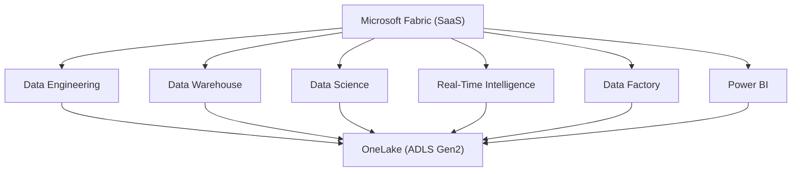
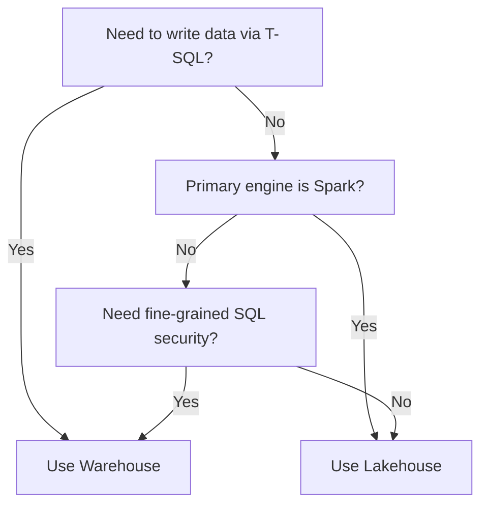

# Fabric Prerequisites
{: .no_toc }

Background knowledge you need before diving into DP-600 exam topics. This page covers the foundational Fabric concepts that every Analytics Engineer question assumes you already understand.

  
Table of contents

  {: .text-delta }
- TOC
{:toc}

---

## Microsoft Fabric Architecture Overview

Microsoft Fabric is a **SaaS analytics platform** that unifies data engineering, data warehousing, data science, real-time intelligence, data integration, and business intelligence into a single product. Instead of stitching together separate Azure services, Fabric provides one integrated experience built on a shared foundation.

### Workloads at a Glance

| Workload | Purpose |
|---|---|
| **Data Engineering** | Spark notebooks, lakehouses, data pipelines |
| **Data Warehouse** | Full T-SQL warehouse with DML/DDL |
| **Data Science** | ML models, experiments, notebooks with MLflow |
| **Real-Time Intelligence** | KQL databases, eventstreams, Real-Time dashboards |
| **Data Factory** | Dataflows Gen2, data pipelines (orchestration) |
| **Power BI** | Semantic models, reports, dashboards, paginated reports |

All workloads read from and write to **OneLake**, which is the key architectural differentiator. There is no data duplication across workloads — one copy of data serves all engines.

> :dart: **Exam Tip:** Questions often test whether you know which workload owns a given item. For example, a *KQL database* belongs to Real-Time Intelligence, not Data Engineering.

---

## OneLake

OneLake is Fabric's **single, unified data lake** for the entire tenant. Think of it as "OneDrive for data." Under the hood it runs on **Azure Data Lake Storage Gen2** with a hierarchical namespace enabled.

### Key Characteristics

- **One copy of data** — all Fabric workloads access the same physical files, eliminating silos and redundant copies.
- **Delta Parquet format** — tables are stored as Delta Lake (Parquet files plus a `_delta_log` transaction log).
- **Shortcuts** — virtual pointers to data in external locations (other OneLake paths, ADLS Gen2, Amazon S3, Google Cloud Storage) without copying.
- **Hierarchical namespace** — organizes data as `onelake://<workspace>/<item>/<path>`.
- **Automatic discovery** — every Fabric item that produces data lands in OneLake automatically.

> :warning: **Exam Caveat:** Shortcuts do **not** copy data. They create a reference. If the source is deleted or access is revoked, the shortcut breaks. Expect scenario questions about this.

---

## Workspaces

A workspace is the **primary container** for all Fabric items (lakehouses, warehouses, notebooks, reports, pipelines, etc.). Every workspace is assigned to exactly one capacity.

### Workspace Roles

| Role | Permissions |
|---|---|
| **Admin** | Full control — manage membership, delete the workspace, manage all items |
| **Member** | Create, edit, delete items; share items; cannot manage workspace settings or membership |
| **Contributor** | Create, edit, delete items; cannot share items or manage membership |
| **Viewer** | View items only; cannot edit, create, or delete |

> :dart: **Exam Tip:** The difference between **Member** and **Contributor** is sharing. Members can share items with other users; Contributors cannot. This distinction appears frequently in permission-related questions.

### Capacity Assignment

Every workspace must be backed by a capacity (or trial/PPU for Power BI-only workloads). Workspace admins assign the workspace to a specific capacity, which determines available compute and the SKU feature set.

---

## Lakehouses

A lakehouse combines the flexibility of a data lake with the query power of a warehouse. It is the central storage item for Data Engineering workloads.

### Anatomy of a Lakehouse

- **Tables section** — managed Delta Lake tables queryable via Spark and the SQL analytics endpoint.
- **Files section** — unstructured or semi-structured files (CSV, JSON, images) stored in OneLake but not registered as tables.
- **SQL analytics endpoint** — an auto-generated, **read-only** T-SQL endpoint that lets you query Delta tables using SQL without Spark. Supports SELECT statements, views, and SQL functions but **no INSERT, UPDATE, DELETE, or DDL**.

> :warning: **Exam Caveat:** The SQL analytics endpoint is **read-only**. You cannot run DML against a lakehouse via T-SQL. If a question asks you to perform T-SQL writes, the answer involves a warehouse, not a lakehouse endpoint.

### When to Use a Lakehouse

- Unstructured or semi-structured data that needs flexible exploration.
- Spark-based data engineering transformations (PySpark, Spark SQL).
- Data science workloads that read Delta tables via notebooks.
- Scenarios where you want one storage layer serving both engineers and analysts.

---

## Warehouses

A Fabric warehouse is a **full relational data warehouse** with complete T-SQL DDL and DML support. Data is still stored as Delta Parquet in OneLake, but the engine provides a traditional SQL experience.

### Key Capabilities

- **Full DML** — INSERT, UPDATE, DELETE, MERGE, COPY INTO.
- **Full DDL** — CREATE TABLE, ALTER TABLE, CREATE VIEW, CREATE SCHEMA, stored procedures.
- **Cross-database queries** — query tables across warehouses and lakehouse SQL endpoints in the same workspace using three-part naming.
- **Security** — column-level security, row-level security, dynamic data masking, object-level permissions.

### Lakehouse vs Warehouse Comparison

| Feature | Lakehouse | Warehouse |
|---|---|---|
| Storage format | Delta Parquet in OneLake | Delta Parquet in OneLake |
| Write via T-SQL | No (read-only SQL endpoint) | Yes (full DML/DDL) |
| Write via Spark | Yes | No |
| Cross-database queries | As a source (read) | Full support |
| Row/column-level security | Not via SQL endpoint | Yes |
| Best for | Engineers, data scientists | Analysts, SQL-centric teams |

> :dart: **Exam Tip:** Both lakehouse and warehouse store data as Delta Parquet in OneLake. The difference is the **engine and write path**, not the storage format.

---

## Capacities and Licensing

Fabric compute is metered through **Capacity Units (CUs)**. Every operation — Spark jobs, SQL queries, dataflows, Power BI refreshes — consumes CUs from the assigned capacity.

### SKU Overview

| SKU | Type | CUs | Typical Use |
|---|---|---|---|
| F2 | Fabric (Azure) | 2 | Dev/test |
| F4 | Fabric (Azure) | 4 | Small workloads |
| F8 | Fabric (Azure) | 8 | Small team |
| F16 | Fabric (Azure) | 16 | Departmental |
| F32 | Fabric (Azure) | 32 | Departmental |
| F64 | Fabric (Azure) | 64 | Enterprise |
| F128+ | Fabric (Azure) | 128+ | Large enterprise |
| P1 | Power BI Premium | 8 CU equiv. | Power BI + limited Fabric |
| P2 | Power BI Premium | 16 CU equiv. | Power BI + limited Fabric |

- **F SKUs** — purchased through Azure, pay-as-you-go or reserved (1-year / 3-year). Support all Fabric workloads. Can be paused to stop billing.
- **P SKUs** — legacy Power BI Premium per-capacity. P1 maps roughly to F8. Microsoft is encouraging migration to F SKUs.
- **Trial capacity** — free 60-day trial with F64-equivalent capacity; one trial per user.

> :warning: **Exam Caveat:** F SKUs can be **paused** (stopping all compute billing), but P SKUs cannot. Also, only F64 and above (or P1 and above) support Fabric features beyond Power BI. Lower F SKUs still run all workloads but with less throughput.

---

## Delta Lake Fundamentals

Delta Lake is the default table format across all of Fabric. Understanding it is non-negotiable for the DP-600.

### Core Properties

- **ACID transactions** — every write is atomic; readers never see partial writes. The `_delta_log` folder contains JSON commit files that track each transaction.
- **Time travel** — query previous versions of a table using `VERSION AS OF` or `TIMESTAMP AS OF` in Spark SQL. Useful for auditing and rollback.
- **Schema enforcement** — writes that do not match the table schema are rejected by default, preventing corrupt data.
- **Schema evolution** — optionally allow new columns by setting `.option("mergeSchema", "true")` on a write operation.

### Fabric-Specific Optimizations

- **V-Order** — a Fabric-specific write-time optimization that reorders Parquet row groups for faster reads across all engines (Spark, SQL, Power BI Direct Lake). V-Order is enabled by default.
- **Optimize Write** — dynamically coalesces small files into larger ones during write to reduce the small-file problem. Also enabled by default in Fabric.

> :dart: **Exam Tip:** V-Order and Optimize Write are **enabled by default** in Fabric Spark. You do not need to turn them on. Expect questions that try to trick you into manually enabling settings that are already active.

---

## Power BI in Fabric

Power BI is both a standalone workload and the analytics layer that sits on top of every other Fabric item.

### Key Items

- **Semantic model (dataset)** — the data model that defines tables, relationships, measures, and calculations. This is what reports query against.
- **Report** — interactive visualizations built on a semantic model.
- **Dashboard** — a single canvas of pinned tiles from one or more reports.
- **Paginated report** — pixel-perfect, print-ready reports (SSRS-style) for invoices, statements, and operational documents.

### Integration with Fabric Items

- **Direct Lake mode** — a new storage mode where Power BI reads Delta Parquet files directly from OneLake without import or DirectQuery. Combines import-speed performance with DirectQuery-level freshness.
- **Default semantic model** — every lakehouse and warehouse auto-generates a default semantic model that analysts can connect to immediately.
- **SQL analytics endpoint** — Power BI can also use DirectQuery against a lakehouse SQL endpoint or warehouse.

> :warning: **Exam Caveat:** Direct Lake is **not** the same as DirectQuery. Direct Lake reads columnar data from Parquet files in memory — it does not issue SQL queries to a source. If Direct Lake cannot load data (e.g., unsupported column type), it **falls back** to DirectQuery automatically.

---

## Key Concepts for Analytics Engineers

### Star Schema Basics

The star schema is the recommended modeling pattern for analytical workloads in Fabric and Power BI.

- **Fact tables** — store measurable events (sales transactions, page views, shipments). Contain foreign keys and numeric measures. Typically large and narrow.
- **Dimension tables** — store descriptive attributes (customer name, product category, date). Contain surrogate keys and text/category columns. Typically small and wide.
- **Relationships** — fact tables reference dimension tables via foreign keys, forming a star shape.

### Slowly Changing Dimensions (SCD)

| Type | Behavior | Implementation |
|---|---|---|
| **SCD Type 1** | Overwrite old value | UPDATE the dimension row in place |
| **SCD Type 2** | Keep full history | Add new row with effective/expiry dates and a current flag |
| **SCD Type 3** | Track limited history | Add a "previous value" column alongside the current value |

> :dart: **Exam Tip:** SCD Type 2 is the most commonly tested. Know that it requires **surrogate keys** (not natural keys) because the same business entity will have multiple rows.

### Data Modeling Best Practices

- Prefer **star schemas** over flat/wide tables for Power BI performance.
- Avoid bi-directional relationships unless absolutely necessary.
- Use **integer surrogate keys** for joins instead of large text business keys.
- Keep fact tables narrow — push descriptive attributes into dimensions.
- Define explicit **date dimensions** rather than relying on auto date/time.

---

## Scenario Quick Reference

| Scenario | Recommended Item | Why |
|---|---|---|
| Ingest raw CSV/JSON and transform with Spark | Lakehouse | Spark-native, files section for raw landing |
| SQL analysts need to write stored procedures | Warehouse | Full T-SQL DDL/DML support |
| Data scientists need to train ML models on tabular data | Lakehouse | Spark notebooks read Delta tables natively |
| Build a star schema with row-level security via T-SQL | Warehouse | RLS and fine-grained SQL security |
| Create a Power BI report with near-real-time data from OneLake | Lakehouse + Direct Lake | Direct Lake reads Delta files with no import lag |
| Reference external S3 data without copying | Lakehouse shortcut | Shortcuts point to external storage without data movement |
| Orchestrate a multi-step ELT pipeline | Data Factory pipeline | Pipelines coordinate activities across items |
| Stream IoT events and query with KQL | Real-Time Intelligence | Eventstreams and KQL databases handle streaming data |
| Need cross-database SQL joins across items | Warehouse | Cross-database queries with three-part naming |
| Store unstructured images alongside tabular data | Lakehouse (Files section) | Files section holds any format; tables hold Delta only |
