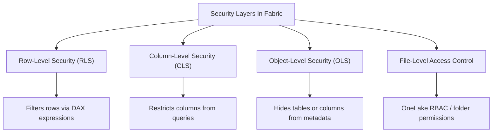
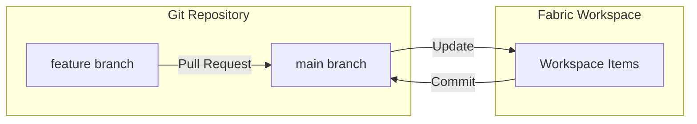
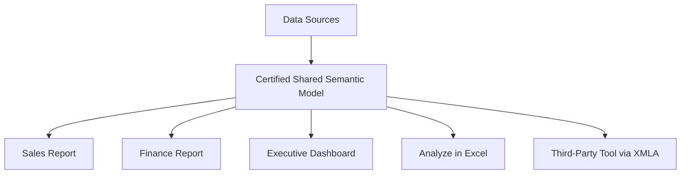

# Maintain a Data Analytics Solution
{: .no_toc }

> - Based on: *Microsoft Fabric documentation* (Microsoft Learn)
> - 📁 [← Back to Home](/dp-600-study-notes/)

Domain 1 accounts for **25–30%** of the DP-600 exam. It spans two broad skill areas: implementing security and governance, and maintaining the analytics development lifecycle across Microsoft Fabric and Power BI.

<details open markdown="block">
  <summary>Table of contents</summary>
  {: .text-delta }
- TOC
{:toc}
</details>

---

## Implement Security and Governance

### Workspace-Level Access Controls

Every Fabric workspace exposes four built-in roles. The exam expects you to know the precise boundary of each role.

| Capability | Admin | Member | Contributor | Viewer |
|---|:---:|:---:|:---:|:---:|
| Read and explore items | Yes | Yes | Yes | Yes |
| Create, edit, and delete items | Yes | Yes | Yes | No |
| Publish and update an app | Yes | Yes | No | No |
| Share items and grant access | Yes | Yes | No | No |
| Manage workspace settings and roles | Yes | No | No | No |
| Add or remove users (all roles) | Yes | No | No | No |
| Add Members/Contributors/Viewers | Yes | Yes | No | No |

> **Exam Tip:** Members can add other Members, Contributors, and Viewers, but they **cannot** add Admins. Only an Admin can grant Admin access.
{: .note }

> **Exam Caveat:** A Contributor can create and edit items inside the workspace but **cannot** share those items or publish an app. Sharing requires the Member (or Admin) role.
{: .warning }

### Item-Level Access Controls

Item-level security operates independently of workspace roles and allows granular distribution of content.

- **Sharing** — Any workspace Member or Admin can share a specific item (report, semantic model, dashboard) with users who have no workspace role at all. Share links can optionally grant Build permission or reshare permission.
- **App permissions** — When publishing a Power BI app, you define one or more audiences. Each audience can see a different subset of reports and dashboards. App consumers do not need a workspace role.
- **Build permission on semantic models** — Grants the ability to create new reports on top of a shared semantic model, use Analyze in Excel, or connect via XMLA. Build permission can be granted through sharing, app settings, or directly in the semantic model permissions pane.

> **Exam Tip:** Build permission is the key permission that enables downstream content creation. If a question mentions allowing someone to create reports on an existing semantic model without workspace access, the answer is Build permission.
{: .note }

### Row-Level, Column-Level, Object-Level, and File-Level Security



| Feature | RLS | CLS | OLS |
|---|---|---|---|
| **What it restricts** | Rows returned by queries | Specific columns | Entire tables or columns from client metadata |
| **Defined where** | DAX filter expression on roles in the semantic model | Model roles using column permissions | Model roles using object metadata permissions |
| **Supported in** | Power BI Desktop, XMLA endpoint, Tabular Editor | XMLA endpoint, Tabular Editor | XMLA endpoint, Tabular Editor |
| **User experience** | Data appears filtered; schema is visible | Column returns errors or blanks | Table or column is invisible to the user |
| **Can be authored in Power BI Desktop?** | Yes | No | No |

- **RLS** uses DAX predicates (e.g., `[Region] = USERPRINCIPALNAME()`) to restrict which rows a user sees. You assign users or security groups to roles.
- **CLS** prevents specific columns from being queried at all. It must be configured via external tooling such as Tabular Editor or XMLA scripts.
- **OLS** removes objects (tables or columns) from the model metadata so clients cannot even discover them. Also requires external tooling.
- **File-level access control** applies to files in OneLake. OneLake folder-level RBAC (role-based access control) restricts read access at the folder or file level inside a lakehouse, independent of the semantic model layer.

> **Exam Caveat:** CLS and OLS **cannot** be configured in Power BI Desktop. The exam may present a scenario asking the simplest tool to set up CLS — the answer involves the XMLA endpoint or Tabular Editor, not Desktop.
{: .warning }

> **Exam Tip:** RLS is enforced for Viewers and users with only Read/Build permission. Workspace Admins, Members, and Contributors are **not** subject to RLS when browsing data inside the workspace — they see all rows. RLS is enforced for these roles only when they consume content through an app or a shared link.
{: .note }

### Sensitivity Labels (Microsoft Purview Information Protection)

Sensitivity labels (Confidential, Highly Confidential, General, etc.) can be applied to Fabric items — semantic models, reports, dashboards, dataflows, and lakehouses. Labels propagate downstream: if a semantic model is labeled **Confidential**, reports built on it inherit that label automatically.

Key points for the exam:

- Labels are defined in the Microsoft Purview compliance portal, not in Fabric.
- Assigning labels in Fabric requires the user to have an appropriate Purview license and the label to be published to them via a label policy.
- Labels persist when data is exported to Excel or PDF (the file carries the label's protection settings).
- Mandatory labeling can be enforced via tenant settings so that users must classify items before saving.

> **Exam Tip:** Sensitivity labels **travel with exports**. A report labeled Highly Confidential will produce an Excel export that retains the Highly Confidential protection. This is a frequent exam topic.
{: .note }

### Endorsing Items (Promoted vs. Certified)

Endorsement signals to consumers which items are trustworthy and authoritative.

| Aspect | Promoted | Certified |
|---|---|---|
| **Who can apply** | Any workspace Member or Admin | Only users explicitly authorized by the Fabric/Power BI admin |
| **Admin configuration required** | No | Yes — admin must designate which users or groups can certify |
| **Visual indicator** | Blue badge | Green badge with checkmark |
| **Intended use** | "This item is ready for broad use" | "This item meets organizational quality and standards" |
| **Governance implication** | Low barrier — self-service | High barrier — organizational control |

> **Exam Caveat:** Certification requires two things: (1) the Fabric admin has enabled certification and designated certifiers, and (2) the certifying user has at least a Member or Admin role on the workspace. Without both, certification is not possible.
{: .warning }

---

## Maintain the Analytics Development Lifecycle

### Version Control for a Workspace (Git Integration)

Fabric workspaces can connect to a remote Git repository in **Azure DevOps** or **GitHub**. This enables source control for items such as semantic models, reports, notebooks, and pipelines.



**Configuration steps:**

1. Open Workspace settings and navigate to Git integration.
2. Connect to an Azure DevOps or GitHub repository and select a branch and folder.
3. Items in the workspace are synced to/from the branch. Changes made in the workspace appear as uncommitted; the user commits when ready.

**Branching strategies the exam expects you to know:**

- **Single branch (main):** Simplest approach. All developers commit to main. Suitable for small teams.
- **Feature branching:** Developers create short-lived branches, make changes, and merge via pull request. Recommended for team collaboration.
- **Environment branching:** Separate branches map to Dev, Test, and Prod workspaces (often combined with deployment pipelines).

> **Exam Tip:** Git integration in Fabric currently supports connecting **one branch per workspace**. If a question asks how two developers work on different features simultaneously, the answer involves creating separate feature branches and separate workspaces (or working locally with PBIP files).
{: .note }

### Power BI Desktop Projects (.pbip)

The PBIP format saves a Power BI project as a folder structure with human-readable JSON files instead of a single compressed binary file.

| Aspect | .pbix | .pbip |
|---|---|---|
| **Format** | Single compressed binary file | Folder with JSON and metadata files |
| **Version control friendly** | No — binary diffs are meaningless | Yes — text-based diffs show exactly what changed |
| **Merge conflicts** | Cannot be resolved in standard tools | Resolvable with standard merge tooling |
| **Sensitivity label support** | Yes | Yes |
| **Sharing as a file** | Easy — single file | Requires the whole folder |
| **Recommended for Git workflows** | No | Yes |

**PBIP folder structure:**

```
MyReport.pbip
MyReport/
  report.json
  definition/
    ...
MyModel/
  model.bim  (or definition/ folder)
  ...
```

> **Exam Caveat:** PBIP is the recommended format for Git-based workflows but is **not** a replacement for PBIX in all scenarios. You cannot directly upload a PBIP folder to the Power BI service as a single action the way you upload a PBIX file. PBIP is designed for developer workflows and source control.
{: .warning }

### Deployment Pipelines

Deployment pipelines provide a managed promotion path for Fabric content across environments.


**Key concepts:**

- A pipeline has up to **10 stages** (commonly three: Dev, Test, Prod).
- Each stage maps to a Fabric workspace.
- You can **compare stages** to see which items differ, which are new, and which are missing.
- **Deployment rules** allow you to change parameters (data source connection strings, lakehouse references) at each stage so that Test points to test data and Prod points to production data.
- You need at least a **Member or Admin** role in both the source and target workspaces to deploy.
- Pipelines support selective deployment — you can choose specific items rather than deploying everything.

**Deployment rules** are critical for the exam. They allow overriding:

- Data source connection strings (e.g., a SQL Server name)
- Parameter values
- Lakehouse or warehouse bindings

> **Exam Tip:** Deployment rules solve the problem of "how do I point my Test semantic model to a test database without manually editing connections." If a scenario describes promoting content but needing different data sources per environment, the answer is deployment rules.
{: .note }

> **Exam Caveat:** Deployment pipelines deploy **metadata only** — they do not copy data. After deploying a semantic model to Production, you still need to refresh it to load data from the production data source.
{: .warning }

### Impact Analysis of Downstream Dependencies

Fabric provides a **lineage view** for every workspace, showing how items relate to each other (data sources, dataflows, lakehouses, semantic models, reports, dashboards).

**Impact analysis** lets you select a specific item and see everything downstream that depends on it. This is essential before making breaking changes.

- If you modify a **lakehouse** table schema, impact analysis shows which dataflows, semantic models, and reports consume that table.
- If you change a **semantic model** measure, impact analysis shows which reports use that measure.
- The lineage view covers cross-workspace dependencies — a report in Workspace B built on a semantic model in Workspace A will appear in the analysis.

> **Exam Tip:** Before renaming a column in a warehouse or lakehouse, always run impact analysis to identify downstream semantic models and reports that reference that column. The exam frequently tests whether you know to check lineage before making schema changes.
{: .note }

### XMLA Endpoint for Semantic Models

The XMLA (XML for Analysis) endpoint exposes Power BI semantic models using the same protocol as SQL Server Analysis Services (SSAS). This enables enterprise tooling.

**Read-only XMLA** (available with Power BI Premium, PPU, or Fabric capacity):

- Query semantic models with SSMS, DAX Studio, Excel, or third-party tools.
- Run DMV queries for diagnostics.

**Read/write XMLA** (must be explicitly enabled in tenant or capacity settings):

- Deploy and modify semantic model metadata (partitions, measures, roles, perspectives).
- Tools: **Tabular Editor**, **ALM Toolkit**, **SSMS**, **Visual Studio (Analysis Services projects)**.
- Use cases: CLS/OLS configuration, automated deployments, CI/CD scripting, incremental refresh partition management.

| Tool | Primary Use |
|---|---|
| Tabular Editor | Full model authoring and editing — measures, partitions, roles, CLS, OLS |
| ALM Toolkit | Schema comparison and selective deployment between models |
| SSMS | Ad-hoc DAX/MDX queries, DMVs, process commands |
| DAX Studio | Performance tuning, query profiling, DMV exploration |

> **Exam Caveat:** Read/write XMLA is **disabled by default**. If a question describes a scenario where a developer cannot deploy changes via Tabular Editor, check whether the XMLA read/write setting is enabled at the tenant or capacity level.
{: .warning }

> **Exam Tip:** Changes made via XMLA **do not appear** in the standard Power BI Desktop round-trip. If someone modifies a model through Tabular Editor and then another developer opens the PBIX in Desktop and republishes, the XMLA changes may be overwritten. This is a governance concern the exam may test.
{: .note }

### Reusable Assets

#### Power BI Template Files (.pbit)

A PBIT file contains the report layout, semantic model schema, queries, and parameters — but **no data**. When opened, it prompts the user to enter parameter values and then refreshes.

- Use case: standardized report templates distributed across teams.
- The recipient needs appropriate data source credentials.

#### Power BI Data Source Files (.pbids)

A PBIDS file contains pre-configured data source connection information (server, database, type). When opened in Power BI Desktop, it launches directly into the connection experience for that source.

- Use case: simplify getting started with the correct data source — users do not need to manually type server names.

#### Shared Semantic Models

Shared semantic models enable a "single version of truth" pattern. A central team publishes a certified semantic model, and report creators across the organization build reports on top of it using a live connection or DirectQuery connection.

- Consumers need **Build permission** on the semantic model.
- Shared semantic models appear in the OneLake data hub for discovery.
- Combining shared semantic models with endorsement (Certified) and sensitivity labels creates a governed, reusable data layer.



> **Exam Tip:** The combination of a **certified shared semantic model** + **Build permission** + **RLS** is the recommended governance pattern for large organizations. Expect the exam to present scenarios where this trio is the answer.
{: .note }

---

## Scenario-Based Quick Reference

| # | Scenario | Answer |
|---|---|---|
| 1 | A user needs to create reports on a semantic model but has no workspace role. | Grant **Build permission** on the semantic model via sharing. |
| 2 | A developer needs to configure OLS to hide a salary column from most users. | Use **Tabular Editor** via the **XMLA read/write endpoint**. Cannot be done in Power BI Desktop. |
| 3 | The team wants to track changes to a semantic model over time with meaningful diffs. | Use the **PBIP** format and store it in a **Git repository**. |
| 4 | The Test workspace needs to point to a test SQL database after deployment. | Configure **deployment rules** in the deployment pipeline to override the connection string. |
| 5 | A workspace Admin wants to ensure only authorized users can mark items as Certified. | The **Fabric admin** must enable certification and designate specific certifiers in the admin portal. |
| 6 | An exported Excel file from a Highly Confidential report must retain protection. | **Sensitivity labels** propagate to exports automatically — no extra configuration needed. |
| 7 | Two developers want to work on separate features in the same Fabric workspace simultaneously. | Each developer creates a **feature branch** linked to a **separate workspace**, then merges via pull request. |
| 8 | After deploying a semantic model to Production via pipeline, users see no data. | Deployment pipelines copy **metadata only**. A **data refresh** must be triggered in Production. |
| 9 | A workspace Member shares a report with a colleague via a link. The colleague can view it but cannot create new reports from the model. | The share link was granted **without Build permission**. Re-share with Build permission enabled. |
| 10 | A developer modifies partitions via Tabular Editor, but a colleague overwrites the changes by republishing the PBIX. | XMLA changes are **overwritten by PBIX publish**. Use PBIP + Git or only XMLA-based deployments to avoid this. |
| 11 | Before renaming a lakehouse column, the team needs to know which reports will break. | Use **lineage view** and **impact analysis** in the Fabric workspace. |
| 12 | A Contributor tries to share a report but the option is grayed out. | Contributors **cannot share items**. The user needs at least a **Member** role. |
| 13 | The organization wants all Fabric items to be classified before saving. | Enable **mandatory sensitivity labeling** in the Fabric tenant settings. |
| 14 | A team distributes a standardized report layout without data so that each region can connect to its own source. | Distribute a **.pbit template file** with parameters for the data source. |
| 15 | An external tool cannot connect to a semantic model via XMLA. | Verify that **XMLA read (or read/write) is enabled** at the tenant or capacity level and that the user has at least **Read and Build permission**. |

---

*These notes cover the "Maintain a data analytics solution" domain of the DP-600 exam. For full coverage, pair these notes with hands-on practice in a Fabric trial or capacity environment.*

---

[← 00 — Fabric Prerequisites](/dp-600-study-notes/00-fabric-prerequisites/) | [02 — Prepare Data →](/dp-600-study-notes/02-prepare-data/)