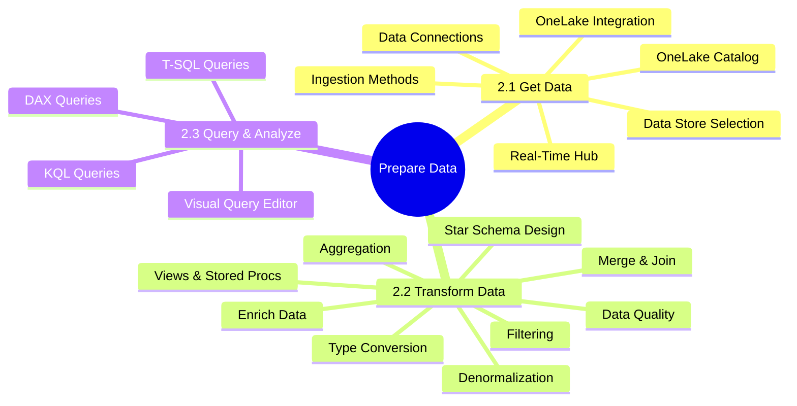
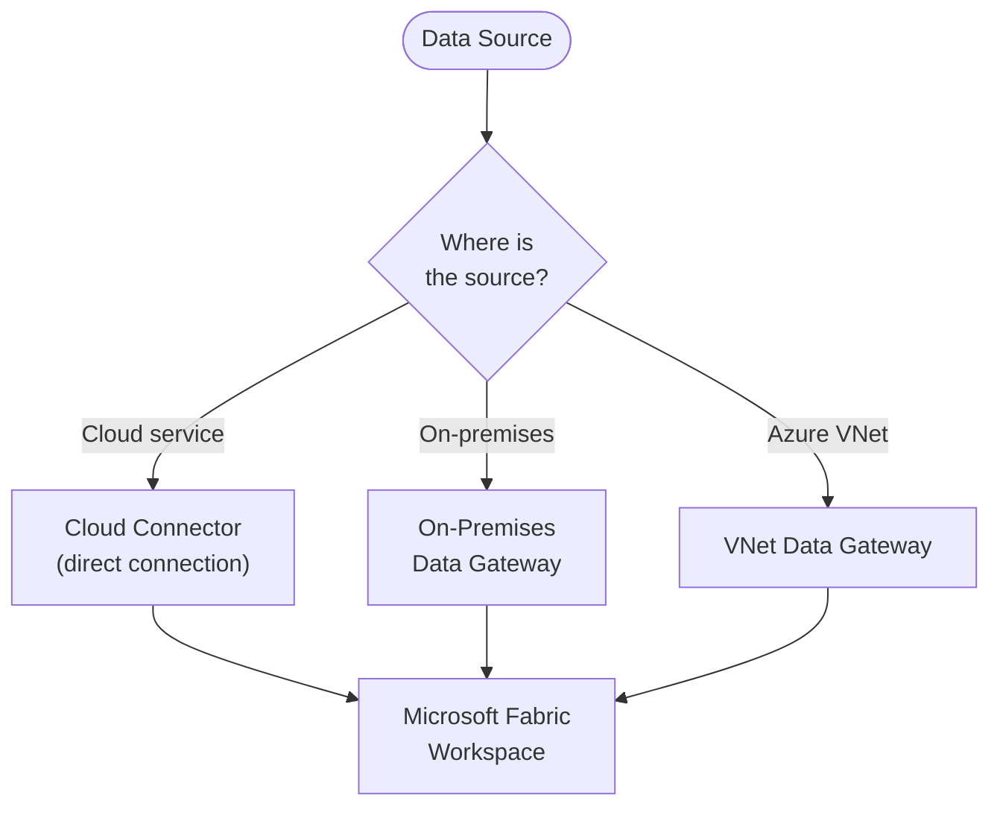
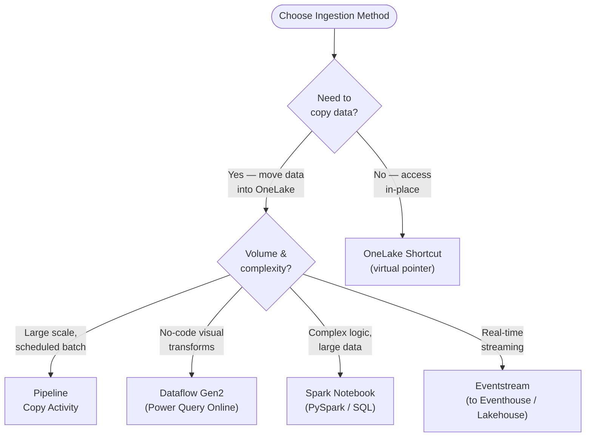
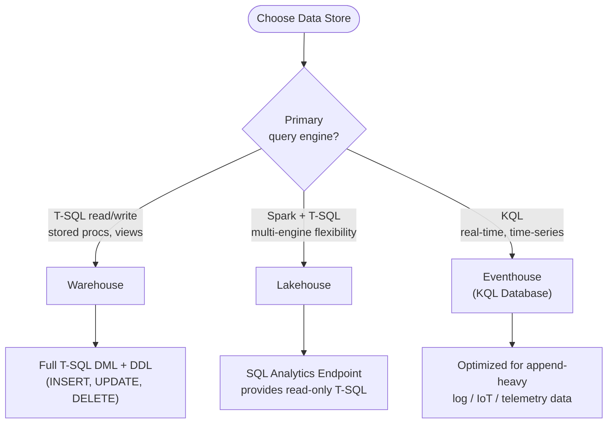
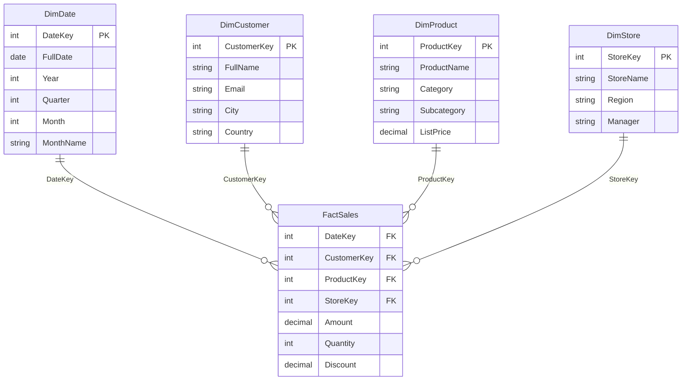
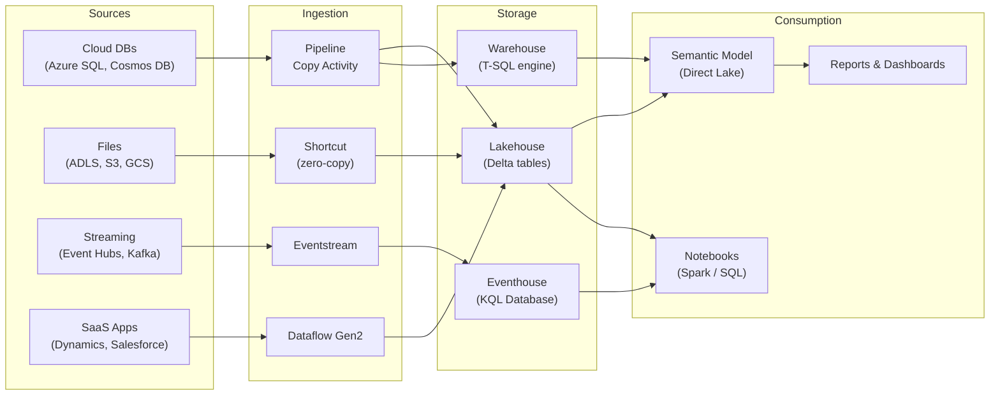

# 🔄 02 — Prepare Data
{: .no_toc }

> - Based on: *Microsoft Fabric documentation* (Microsoft Learn)
> - 📁 [← Back to Home](/dp-600-study-notes/)

Domain 2 is the heaviest weighted on the DP-600 exam, covering **45–50%** of the questions. This domain tests your ability to connect to data sources, discover data using OneLake catalog, choose appropriate data stores (lakehouse, warehouse, eventhouse), and perform data transformations using SQL, KQL, and DAX.

<details open markdown="block">
  <summary>Table of contents</summary>
  {: .text-delta }
- TOC
{:toc}
</details>

---

## 📊 Domain Overview



---

## 📥 2.1 Get Data

### 🔌 Create a Data Connection

Data connections in Microsoft Fabric link workspaces to external or internal sources. The two primary components are **connectors** and **gateways**.

| Component | Purpose | When to Use |
|-----------|---------|-------------|
| **Cloud connectors** | Direct connection to cloud services (Azure SQL, ADLS Gen2, Dataverse) | Source is publicly accessible or within Azure |
| **On-premises data gateway** | Encrypted bridge between on-prem data and Fabric | Source is behind a firewall or on a private network |
| **VNet data gateway** | Connects to data sources within an Azure VNet | Source is in a private VNet (no on-prem agent needed) |
| **Personal gateway** | Single-user gateway for development/testing | Prototyping only; not recommended for production |



> **Exam Caveat:** The on-premises data gateway requires installation on a local machine and must be registered in the Fabric admin portal. A **VNet data gateway** does NOT require a local installation — it runs as an Azure-managed service inside the VNet.
{: .warning }

> **Exam Tip:** If the question mentions a data source inside an Azure Virtual Network, the answer is **VNet data gateway** — not the on-premises gateway.
{: .note }

---

### 🔎 Discover Data by Using OneLake Catalog and Real-Time Hub

**OneLake catalog** (formerly OneLake data hub) is the centralized discovery experience where users browse, search, and access endorsed data items across the Fabric tenant.

| Feature | OneLake Catalog | Real-Time Hub |
|---------|----------------|---------------|
| **Purpose** | Discover lakehouses, warehouses, semantic models, reports | Discover and connect to real-time data streams |
| **Data type** | Batch and stored data | Streaming and event data |
| **Sources** | Fabric items across workspaces | Event Hubs, Eventstreams, CDC streams, custom apps |
| **Action** | Open, connect, or create shortcuts | Subscribe, route to Eventhouse or Lakehouse |

> **Exam Tip:** OneLake catalog shows items that have been **endorsed** (Promoted or Certified). Know the difference: **Promoted** = self-service endorsement by the item owner; **Certified** = organization-level endorsement requiring admin-defined permissions.
{: .note }

---

### 📤 Ingest or Access Data as Needed



#### Ingestion Methods Comparison

| Method | Code Required | Best For | Scheduling | Transform Capability |
|--------|:------------:|----------|:----------:|---------------------|
| **Copy Activity (Pipeline)** | ❌ | Bulk ETL, 90+ source connectors | ✅ (triggers, schedule) | Minimal (column mapping) |
| **Dataflow Gen2** | ❌ (M / Power Query) | Self-service, moderate transforms | ✅ (pipeline orchestration) | Rich (300+ transforms) |
| **Spark Notebook** | ✅ (PySpark, Spark SQL) | Complex transforms, ML, large data | ✅ (pipeline, schedule) | Full programmatic control |
| **Shortcut** | ❌ | Zero-copy access to ADLS, S3, GCS, other lakehouses | N/A (live pointer) | None (query at read time) |
| **Eventstream** | ❌ | Real-time ingestion from Event Hubs, Kafka | Continuous | Inline transforms |

> **Exam Caveat:** Shortcuts do NOT copy data — they create a virtual pointer. This means shortcut data is NOT included in lakehouse OPTIMIZE or VACUUM operations. For exam questions about reducing data duplication, shortcuts are the answer.
{: .warning }

> **Exam Caveat:** Dataflow Gen2 outputs can land in a **lakehouse, warehouse, or KQL database**. Dataflow Gen1 (legacy) only targets Power BI datasets. The exam tests Gen2 specifically.
{: .warning }

---

### ⚖️ Choose Between Different Data Stores

This is a critical decision tree tested heavily on the exam.



#### Data Store Selection Matrix

| Criterion | Lakehouse | Warehouse | Eventhouse (KQL DB) |
|-----------|:---------:|:---------:|:-------------------:|
| **Engine** | Spark + SQL Analytics Endpoint | Full T-SQL | KQL |
| **Write via T-SQL** | ❌ (read-only endpoint) | ✅ (INSERT, UPDATE, DELETE) | ❌ |
| **Write via Spark** | ✅ | ❌ | ❌ |
| **File format** | Delta (Parquet) | Proprietary (managed) | Columnar (KQL engine) |
| **Schema enforcement** | Schema-on-read or schema-on-write | Schema-on-write (strict) | Schema-on-write |
| **Unstructured files** | ✅ (Files/ folder) | ❌ | ❌ |
| **Best for** | Data engineering, ML, flexible ETL | Enterprise DW, SQL-heavy BI | Real-time analytics, logs, IoT |

> **Exam Tip:** If the scenario says "T-SQL stored procedures are needed for data transformation," the answer is **Warehouse** — the Lakehouse SQL Analytics Endpoint is **read-only**.
{: .note }

> **Exam Caveat:** A lakehouse has TWO entry points: (1) the Spark engine for read/write, and (2) the SQL analytics endpoint for read-only T-SQL. The exam frequently tests which operations are available on each.
{: .warning }

---

### 🔗 Implement OneLake Integration for Eventhouse and Semantic Models

**Eventhouse OneLake integration** allows KQL database data to be mirrored to OneLake in Delta format, making it queryable by Spark and SQL engines.

**Semantic model OneLake integration** enables Direct Lake mode, where a semantic model reads Parquet/Delta files directly from OneLake without importing data into memory upfront.

| Integration | Data Flow | Format in OneLake | Benefit |
|-------------|-----------|-------------------|---------|
| **Eventhouse to OneLake** | KQL DB tables mirrored to OneLake | Delta (Parquet) | Cross-engine queries (Spark, SQL) on real-time data |
| **Semantic model (Direct Lake)** | Semantic model reads from OneLake | Delta (Parquet) | No import needed; near-real-time freshness |

> **Exam Caveat:** OneLake availability for Eventhouse must be enabled at the **database level**. Not all KQL tables are mirrored by default — you configure which tables to expose.
{: .warning }

---

## ⚙️ 2.2 Transform Data

### 🧱 Create Views, Functions, and Stored Procedures

These objects are available in the **Warehouse** and, for Views only, in the **SQL Analytics Endpoint** (Lakehouse).

| Object | Warehouse | SQL Analytics Endpoint (Lakehouse) |
|--------|:---------:|:---------------------------------:|
| **Views** | ✅ (CREATE VIEW) | ✅ (auto-generated + custom) |
| **Stored Procedures** | ✅ (CREATE PROCEDURE) | ❌ |
| **Table-Valued Functions** | ✅ | ❌ |
| **Scalar Functions** | ✅ | ❌ |

```sql
-- Warehouse: Create a reusable view
CREATE VIEW dbo.vw_ActiveCustomers AS
SELECT CustomerKey, FullName, Email, City
FROM dbo.DimCustomer
WHERE IsActive = 1;

-- Warehouse: Create a stored procedure for ETL
CREATE PROCEDURE dbo.usp_LoadFactSales
AS
BEGIN
    INSERT INTO dbo.FactSales (DateKey, CustomerKey, ProductKey, Amount)
    SELECT
        CAST(FORMAT(OrderDate, 'yyyyMMdd') AS INT),
        CustomerKey,
        ProductKey,
        TotalAmount
    FROM dbo.staging_Sales;
END;
```

> **Exam Tip:** The Lakehouse SQL Analytics Endpoint auto-generates Views for each Delta table. You *CAN* create custom views on top of these, but you *CANNOT* create stored procedures or functions.
{: .note }

---

### ➕ Enrich Data by Adding New Columns or Tables

Enrichment adds calculated or derived information to existing datasets.

| Technique | Tool | Example |
|-----------|------|---------|
| **Computed column** | SQL (Warehouse) | `ALTER TABLE ... ADD FullName AS FirstName + ' ' + LastName` |
| **Derived column** | Dataflow Gen2 | Add Column > Custom Column in Power Query |
| **withColumn** | PySpark (Notebook) | `df.withColumn("Margin", col("Revenue") - col("Cost"))` |
| **Lookup / Merge** | Dataflow Gen2 | Merge with reference table to add descriptions |
| **Reference table** | SQL (Warehouse) | JOIN with a dimension table to add category names |

---

### ⭐ Implement a Star Schema for a Lakehouse or Warehouse

The Star Schema is the **recommended modeling pattern** for analytics in Fabric. It optimizes query performance and simplifies semantic model design.



**Star schema design rules:**

1. **Fact tables** store measurable events (sales, orders, clicks) with foreign keys to dimensions
2. **Dimension tables** store descriptive attributes (customer name, product category, date)
3. **Surrogate keys** are integer keys (auto-generated) that replace natural/business keys
4. **Date dimension** should always be a separate table — never rely on date columns in the fact table
5. **Avoid Snowflake Schemas** in Fabric semantic models (flatten hierarchies into dimensions)

```sql
-- Create a dimension table with surrogate key in Warehouse
CREATE TABLE dbo.DimCustomer (
    CustomerKey INT IDENTITY(1,1) NOT NULL,
    CustomerID  NVARCHAR(20) NOT NULL,   -- natural / business key
    FullName    NVARCHAR(100),
    Email       NVARCHAR(200),
    City        NVARCHAR(100),
    Country     NVARCHAR(100),
    IsActive    BIT DEFAULT 1
);

-- Create a fact table referencing dimensions
CREATE TABLE dbo.FactSales (
    DateKey      INT NOT NULL,
    CustomerKey  INT NOT NULL,
    ProductKey   INT NOT NULL,
    StoreKey     INT NOT NULL,
    Amount       DECIMAL(18,2),
    Quantity     INT,
    Discount     DECIMAL(5,2)
);
```

> **Exam Caveat:** Fabric Warehouse supports `IDENTITY` columns for surrogate keys, but the Lakehouse (Delta tables via Spark) does NOT. In Lakehouses, use `monotonically_increasing_id()` in PySpark or a manual key generation approach.
{: .warning }

> **Exam Tip:** The exam tests why surrogate keys are preferred over natural keys: (1) they are stable even when business keys change, (2) they are integers which join faster, (3) they handle unknown/missing dimension members (e.g., key = -1).
{: .note }

---

### 📋 Denormalize Data

Denormalization flattens related tables into fewer, wider tables to improve read performance.

| Aspect | Normalized | Denormalized |
|--------|-----------|-------------|
| **Tables** | Many narrow tables | Fewer wide tables |
| **Redundancy** | Minimal | Intentional duplication |
| **Write performance** | Better (less data to update) | Worse (update anomalies possible) |
| **Read performance** | Slower (many JOINs) | Faster (pre-joined) |
| **Best for** | OLTP / transactional systems | OLAP / analytics & reporting |

> **Exam Tip:** In Fabric, the Gold layer of a medallion architecture is typically **denormalized** into star schema fact and dimension tables. If a question asks about optimizing for reporting, denormalization is the answer.
{: .note }

---

### 📊 Aggregate Data

Pre-aggregation reduces data volume and speeds up queries for dashboards and reports.

| Technique | Where | Example |
|-----------|-------|---------|
| **Aggregation table** | Lakehouse / Warehouse | `CREATE TABLE agg_MonthlySales AS SELECT ...` |
| **Materialized view** | Warehouse (preview) | Pre-computed query results, auto-refreshed |
| **GROUP BY query** | SQL / KQL | On-the-fly aggregation at query time |
| **Aggregations (semantic model)** | Power BI / Direct Lake | User aggregation tables mapped to detail tables |

```sql
-- Pre-aggregation table in Warehouse
CREATE TABLE dbo.agg_MonthlySales AS
SELECT
    YEAR(OrderDate) AS SalesYear,
    MONTH(OrderDate) AS SalesMonth,
    ProductCategory,
    SUM(Amount) AS TotalAmount,
    COUNT(*) AS OrderCount
FROM dbo.FactSales f
JOIN dbo.DimProduct p ON f.ProductKey = p.ProductKey
JOIN dbo.DimDate d ON f.DateKey = d.DateKey
GROUP BY YEAR(OrderDate), MONTH(OrderDate), ProductCategory;
```

> **Exam Caveat:** Fabric Warehouse supports **materialized views** as a preview feature. They are auto-refreshed when underlying data changes. Do not confuse with standard views, which are computed at query time.
{: .warning }

---

### 🔀 Merge or Join Data

#### Join Types

| Join Type | Returns | SQL Keyword | Dataflow Gen2 |
|-----------|---------|-------------|---------------|
| **Inner Join** | Only matching rows from both tables | `INNER JOIN` | Merge > Inner |
| **Left Outer** | All rows from left + matches from right | `LEFT JOIN` | Merge > Left Outer |
| **Right Outer** | All rows from right + matches from left | `RIGHT JOIN` | Merge > Right Outer |
| **Full Outer** | All rows from both tables | `FULL OUTER JOIN` | Merge > Full Outer |
| **Cross Join** | Cartesian product (every combination) | `CROSS JOIN` | Merge > Cross |
| **Left Anti** | Left rows with NO match in right | `LEFT JOIN ... WHERE right.key IS NULL` | Merge > Left Anti |

```sql
-- Inner join: Sales with customer details
SELECT f.Amount, f.Quantity, c.FullName, c.City
FROM dbo.FactSales f
INNER JOIN dbo.DimCustomer c ON f.CustomerKey = c.CustomerKey;

-- Left anti join: Customers with no sales
SELECT c.CustomerKey, c.FullName
FROM dbo.DimCustomer c
LEFT JOIN dbo.FactSales f ON c.CustomerKey = f.CustomerKey
WHERE f.CustomerKey IS NULL;
```

> **Exam Tip:** In Dataflow Gen2, a **Left Anti** join is available as a native merge type — this is commonly tested. It returns rows from the left table that have NO match in the right table.
{: .note }

---

### 🧹 Identify and Resolve Duplicate Data, Missing Data, or Null Values

| Issue | Detection | Resolution |
|-------|-----------|------------|
| **Duplicates** | `GROUP BY ... HAVING COUNT(*) > 1` | `ROW_NUMBER()` + filter, or `DISTINCT` |
| **Null values** | `WHERE column IS NULL` | `COALESCE()`, `ISNULL()`, default values |
| **Missing rows** | Compare row counts across joins | Anti-join to find orphaned records |
| **Blank strings** | `WHERE column = '' OR LEN(TRIM(column)) = 0` | Replace with NULL or default value |

```sql
-- Find and remove duplicates using ROW_NUMBER
WITH ranked AS (
    SELECT *,
        ROW_NUMBER() OVER (
            PARTITION BY CustomerID
            ORDER BY ModifiedDate DESC
        ) AS rn
    FROM dbo.staging_Customers
)
SELECT * FROM ranked WHERE rn = 1;

-- Handle null values
SELECT
    CustomerKey,
    COALESCE(Email, 'unknown@example.com') AS Email,
    ISNULL(City, 'Unknown') AS City
FROM dbo.DimCustomer;
```

---

### 🔄 Convert Column Data Types

| Tool | Syntax |
|------|--------|
| **SQL (Warehouse)** | `CAST(column AS INT)` or `CONVERT(DATE, column, 103)` |
| **Dataflow Gen2** | Right-click column header > Change Type |
| **PySpark** | `df.withColumn("col", col("col").cast("integer"))` |
| **DAX** (calculated column) | `FORMAT()`, `VALUE()`, `INT()` |

> **Exam Caveat:** In Fabric Warehouse, `CONVERT` with style codes is supported for date/string conversions. The exam may test specific style codes (e.g., `103` = dd/mm/yyyy, `120` = yyyy-mm-dd hh:mi:ss).
{: .warning }

---

### 🔽 Filter Data

Filtering removes unwanted rows early in the pipeline to reduce processing volume and improve performance.

| Layer | Method | Example |
|-------|--------|---------|
| **Source (query folding)** | Dataflow Gen2 filter before load | Native query pushed to source |
| **Ingestion** | Copy Activity filter (SELECT query) | `SELECT * FROM Sales WHERE Year >= 2023` |
| **Transform** | SQL WHERE, PySpark .filter() | `df.filter(col("status") == "Active")` |
| **Semantic model** | RLS / role filters | `[Region] = USERPRINCIPALNAME()` |

> **Exam Tip:** **Query folding** in Dataflow Gen2 is critical — if a step folds, it is pushed to the source database and runs there (much faster). Exam questions test whether specific Power Query steps break folding.
{: .note }

---

## 🔍 2.3 Query and Analyze Data

### 🖱️ Select, Filter, and Aggregate Data by Using the Visual Query Editor

The **Visual Query Editor** is a drag-and-drop interface available in the Lakehouse SQL Analytics Endpoint and Warehouse.

Key capabilities:
- Drag tables onto the canvas and visually define joins
- Select columns, apply filters, add aggregations without writing SQL
- Generates T-SQL under the hood — you can switch to SQL view to see the query
- Supports GROUP BY, ORDER BY, TOP, and WHERE clauses visually

> **Exam Tip:** The Visual Query Editor is the correct answer when the scenario describes a **business analyst** or **citizen developer** who needs to query Lakehouse or Warehouse data without writing SQL.
{: .note }

---

### 💾 Select, Filter, and Aggregate Data by Using SQL

T-SQL is the primary query language for Fabric Warehouse and the SQL Analytics Endpoint.

```sql
-- Common analytical query pattern
SELECT
    d.Year,
    d.MonthName,
    p.Category,
    SUM(f.Amount)   AS TotalRevenue,
    COUNT(*)         AS OrderCount,
    AVG(f.Amount)    AS AvgOrderValue
FROM dbo.FactSales f
JOIN dbo.DimDate d      ON f.DateKey = d.DateKey
JOIN dbo.DimProduct p   ON f.ProductKey = p.ProductKey
WHERE d.Year = 2024
GROUP BY d.Year, d.MonthName, p.Category
ORDER BY TotalRevenue DESC;

-- Window functions for running totals
SELECT
    OrderDate,
    Amount,
    SUM(Amount) OVER (ORDER BY OrderDate ROWS UNBOUNDED PRECEDING) AS RunningTotal
FROM dbo.FactSales;

-- TOP N with ties
SELECT TOP 10 WITH TIES
    p.ProductName,
    SUM(f.Amount) AS TotalSales
FROM dbo.FactSales f
JOIN dbo.DimProduct p ON f.ProductKey = p.ProductKey
GROUP BY p.ProductName
ORDER BY TotalSales DESC;
```

> **Exam Caveat:** The SQL Analytics Endpoint (Lakehouse) supports **read-only** T-SQL: SELECT, CREATE VIEW, CREATE FUNCTION (inline TVF). It does NOT support INSERT, UPDATE, DELETE, CREATE TABLE, or stored procedures.
{: .warning }

---

### 🔍 Select, Filter, and Aggregate Data by Using KQL

KQL (Kusto Query Language) is used in **Eventhouse / KQL databases** for real-time and time-series analytics.

```kql
// Basic KQL: filter and project
StormEvents
| where StartTime between (datetime(2024-01-01) .. datetime(2024-12-31))
| where State == "TEXAS"
| project StartTime, EventType, DamageProperty
| order by DamageProperty desc
| take 100

// Aggregation with summarize
StormEvents
| summarize
    EventCount = count(),
    TotalDamage = sum(DamageProperty),
    AvgDamage = avg(DamageProperty)
    by State
| order by TotalDamage desc

// Time-series binning
StormEvents
| summarize EventCount = count() by bin(StartTime, 1d)
| render timechart

// Distinct values
StormEvents
| distinct EventType
| order by EventType asc
```

**KQL vs SQL — Key Syntax Differences:**

| Operation | SQL | KQL |
|-----------|-----|-----|
| **Filter rows** | `WHERE column = value` | `where column == value` |
| **Select columns** | `SELECT col1, col2` | `project col1, col2` |
| **Aggregate** | `GROUP BY col` | `summarize ... by col` |
| **Sort** | `ORDER BY col DESC` | `order by col desc` |
| **Limit rows** | `TOP 10` | `take 10` |
| **Count** | `COUNT(*)` | `count()` |
| **Time bucket** | `DATEPART(hour, col)` | `bin(col, 1h)` |

> **Exam Tip:** KQL uses a **pipe-based** syntax where each operator filters/transforms the result of the previous step. The exam tests basic KQL operators: `where`, `project`, `summarize`, `order by`, `take`, `bin()`, `count()`, `sum()`, `avg()`.
{: .note }

> **Exam Caveat:** KQL databases are optimized for **append-heavy, time-series data** (logs, IoT telemetry, clickstreams). If the scenario involves real-time or near-real-time analytics on event data, the answer is Eventhouse + KQL.
{: .warning }

---

### 📐 Select, Filter, and Aggregate Data by Using DAX

DAX queries use the `EVALUATE` statement and are executed in tools like DAX Studio, SSMS (via XMLA endpoint), or Fabric notebook.

```dax
// Basic EVALUATE query
EVALUATE
SUMMARIZECOLUMNS(
    DimProduct[Category],
    DimDate[Year],
    "Total Revenue", SUM(FactSales[Amount]),
    "Order Count", COUNTROWS(FactSales)
)

// Filtered query with CALCULATETABLE
EVALUATE
CALCULATETABLE(
    SUMMARIZECOLUMNS(
        DimProduct[Category],
        "Total Revenue", SUM(FactSales[Amount])
    ),
    DimDate[Year] = 2024,
    DimCustomer[Country] = "United States"
)

// FILTER for complex conditions
EVALUATE
FILTER(
    SUMMARIZECOLUMNS(
        DimProduct[Category],
        "Total Revenue", SUM(FactSales[Amount])
    ),
    [Total Revenue] > 100000
)

// TOPN with DAX
EVALUATE
TOPN(
    10,
    SUMMARIZECOLUMNS(
        DimProduct[ProductName],
        "Total Sales", SUM(FactSales[Amount])
    ),
    [Total Sales], DESC
)
```

**Key DAX query functions:**

| Function | Purpose | Example |
|----------|---------|---------|
| `EVALUATE` | Required statement to return a table | Every DAX query starts with EVALUATE |
| `SUMMARIZECOLUMNS` | Group by + aggregate (recommended) | Group sales by category |
| `CALCULATETABLE` | Apply filters to a table expression | Filter to a specific year |
| `FILTER` | Row-by-row filter on a table | Filter aggregated results |
| `TOPN` | Return top N rows | Top 10 products by sales |
| `ALL` / `ALLEXCEPT` | Remove filters from columns/tables | Override slicer context |

> **Exam Caveat:** `SUMMARIZECOLUMNS` is the recommended function for DAX queries (replaces the older `SUMMARIZE` + `ADDCOLUMNS` pattern). The exam strongly favors `SUMMARIZECOLUMNS` for grouping and aggregating.
{: .warning }

> **Exam Tip:** `CALCULATETABLE` modifies filter context for an entire table expression, while `FILTER` iterates row by row. For simple equality filters, `CALCULATETABLE` is more efficient. For complex conditions (e.g., measures > threshold), `FILTER` is needed.
{: .note }

---

## 🔗 End-to-End Data Flow



---

## 📋 Scenario-Based Quick Reference

| # | Scenario | Answer |
|---|----------|--------|
| 1 | Data source is behind a corporate firewall | **On-premises data gateway** |
| 2 | Data source is inside an Azure VNet | **VNet data gateway** |
| 3 | Need zero-copy access to ADLS Gen2 files | **OneLake shortcut** |
| 4 | Business analyst needs to discover endorsed datasets | **OneLake catalog** |
| 5 | Need to ingest streaming data from Event Hubs | **Eventstream to Eventhouse** |
| 6 | Self-service, no-code data transform with 300+ transforms | **Dataflow Gen2** |
| 7 | Complex PySpark transforms on large data in lakehouse | **Spark Notebook** |
| 8 | Bulk batch ingestion from 90+ connectors on a schedule | **Pipeline Copy Activity** |
| 9 | Need stored procedures and full T-SQL DML | **Warehouse** |
| 10 | Need Spark + read-only SQL on Delta tables | **Lakehouse** |
| 11 | Real-time analytics on time-series / IoT data | **Eventhouse (KQL Database)** |
| 12 | Auto-generate integer surrogate keys in a warehouse | **IDENTITY column** |
| 13 | Generate surrogate keys in a lakehouse (PySpark) | **monotonically_increasing_id()** |
| 14 | Flatten a snowflake schema for a semantic model | **Denormalize into star schema** |
| 15 | Pre-compute aggregates that auto-refresh on data change | **Materialized view (Warehouse)** |
| 16 | Find rows in table A that have no match in table B | **Left Anti join** |
| 17 | Remove duplicates keeping the most recent row | **ROW_NUMBER() PARTITION BY ... ORDER BY date DESC** |
| 18 | Non-technical user needs to query warehouse data visually | **Visual Query Editor** |
| 19 | DAX query to group and aggregate a semantic model | **EVALUATE + SUMMARIZECOLUMNS** |
| 20 | Analyze time-series event data with time bucketing | **KQL: summarize ... by bin()** |
| 21 | Make Eventhouse data queryable by Spark and SQL | **OneLake integration for Eventhouse** |
| 22 | Ensure Dataflow Gen2 filter runs at the source, not in memory | **Query folding** (check native query) |

---

> **Final Exam Tip:** This domain covers nearly half the exam. Prioritize the **data store selection matrix**, **star schema design**, **ingestion method comparison**, and **basic SQL/KQL/DAX query patterns**. These appear in nearly every practice test.
{: .note }

---

*These notes cover the "Prepare Data" domain of the DP-600 exam. For full coverage, pair these notes with hands-on practice in a Fabric trial or capacity environment.*

---

[← 01 — Maintain a Data Analytics Solution](/dp-600-study-notes/01-maintain-data-analytics-solution/) | [03 — Implement and Manage Semantic Models →](/dp-600-study-notes/03-implement-manage-semantic-models/)