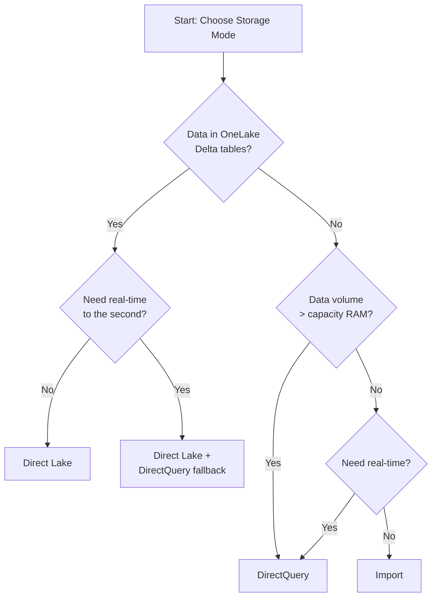
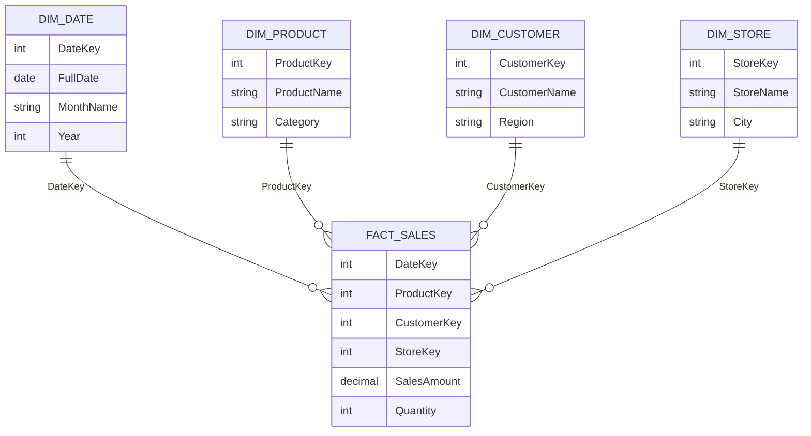
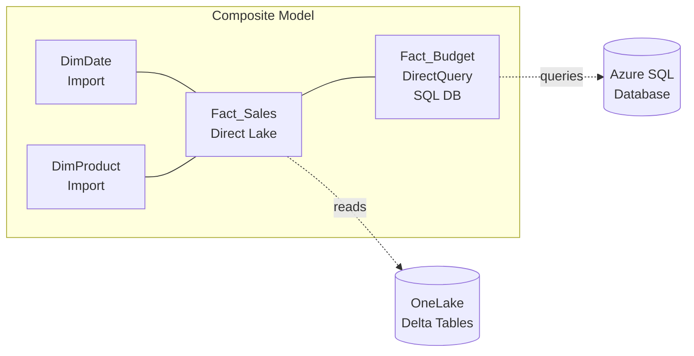
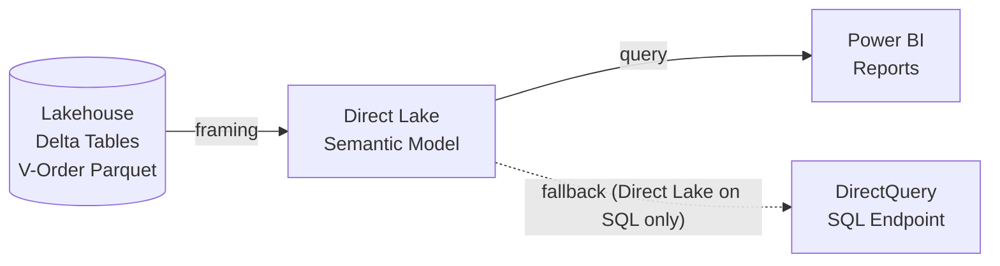

# 📐 Implement & Manage Semantic Models
{: .no_toc }

> - Based on: *Microsoft Fabric documentation* (Microsoft Learn)
> - 📁 [← Back to Home](/dp-600-study-notes/)

Domain 3 accounts for **25–30 %** of the DP-600 exam. It spans semantic-model design (storage modes, star schemas, relationships, DAX, calculation groups, composite models) and enterprise-scale optimization (DAX tuning, Direct Lake configuration, incremental refresh).

<details open markdown="block">
  <summary>Table of contents</summary>
  {: .text-delta }
- TOC
{:toc}
</details>

---

## 🏗️ Design and Build Semantic Models

### 💾 Choose a Storage Mode

Power BI semantic models support three storage modes. The right choice depends on data volume, latency requirements, and whether Microsoft Fabric is in play.

| Aspect | Import | DirectQuery | Direct Lake |
|---|---|---|---|
| **Data location** | Compressed in-memory (VertiPaq) | Stays in source; queries sent live | Delta tables in OneLake, loaded on demand |
| **Performance** | Fastest queries | Slower — depends on source | Near-Import speed, no copy |
| **Data freshness** | Stale until refresh | Real-time | Near-real-time (framing) |
| **Model size limit** | SKU RAM / Premium capacity | No hard limit | SKU guardrails apply |
| **Transformation layer** | Power Query (M) in dataset | Limited PQ; views in source | Notebooks / Dataflows → Lakehouse |
| **Best for** | Small–mid datasets needing speed | Real-time on relational sources | Fabric-native analytics at scale |


```mermaid
flowchart TD
    A[Start: Choose Storage Mode] --> B{Data in OneLake<br/>Delta tables?}
    B -- Yes --> C{Need real-time<br/>to the second?}
    C -- No --> D[Direct Lake]
    C -- Yes --> E[Direct Lake +<br/>DirectQuery fallback]
    B -- No --> F{Data volume<br/>> capacity RAM?}
    F -- Yes --> G[DirectQuery]
    F -- No --> H{Need real-time?}
    H -- Yes --> G
    H -- No --> I[Import]
```

> 🎯 **Exam Tip:** Direct Lake is the preferred mode for Fabric workloads. It reads Parquet files directly from OneLake — no data copy, no scheduled refresh in the Import sense. Know that it **requires Delta tables in a Lakehouse or Warehouse**.

> ⚠️ **Exam Caveat:** Direct Lake is **only** available in Microsoft Fabric capacities (F SKUs) and Power BI Premium (P SKUs). It is not available in Pro-only workspaces or shared capacity.

---

### ⭐ Implement a Star Schema

A star schema organises the semantic model around **fact tables** (events / measures) surrounded by **dimension tables** (descriptive attributes). This is the foundation for performant DAX and clean reports.


```mermaid
erDiagram
    DIM_DATE ||--o{ FACT_SALES : "DateKey"
    DIM_PRODUCT ||--o{ FACT_SALES : "ProductKey"
    DIM_CUSTOMER ||--o{ FACT_SALES : "CustomerKey"
    DIM_STORE ||--o{ FACT_SALES : "StoreKey"

    FACT_SALES {
        int DateKey
        int ProductKey
        int CustomerKey
        int StoreKey
        decimal SalesAmount
        int Quantity
    }
    DIM_DATE {
        int DateKey
        date FullDate
        string MonthName
        int Year
    }
    DIM_PRODUCT {
        int ProductKey
        string ProductName
        string Category
    }
    DIM_CUSTOMER {
        int CustomerKey
        string CustomerName
        string Region
    }
    DIM_STORE {
        int StoreKey
        string StoreName
        string City
    }
```

**Star vs Snowflake:**

| Star Schema | Snowflake Schema |
|---|---|
| Dimensions fully denormalised | Dimensions normalised into sub-tables |
| Fewer joins → faster VertiPaq scans | More joins → harder for the engine to optimise |
| Recommended for Power BI | Acceptable at source; flatten before model |

> 🎯 **Exam Tip:** The exam strongly favours **star schemas**. If a question describes a normalised or snowflake source, the correct answer usually involves flattening dimensions in Power Query or the Lakehouse layer before loading into the model.

---

### 🔗 Implement Relationships

#### Core Relationship Properties

| Property | Options | Notes |
|---|---|---|
| **Cardinality** | One-to-many (1:*), Many-to-one (*:1), One-to-one (1:1), Many-to-many (*:*) | 1:* is the default and preferred |
| **Cross-filter direction** | Single, Both (bi-directional) | Both enables filtering from fact → dimension; use sparingly |
| **Active / Inactive** | One active per path; others inactive | Invoke inactive relationships with `USERELATIONSHIP` |

#### Bridge Tables and Many-to-Many

When a fact table has multiple values per dimension row (e.g., a patient with many diagnoses), insert a **bridge table** between them. Set the bridge-to-fact side as many-to-many and enable bi-directional filtering — or better, use DAX measures with `CALCULATE` + `CROSSFILTER`.

#### Role-Playing Dimensions with USERELATIONSHIP

A Date dimension often plays multiple roles (Order Date, Ship Date, Due Date). Only one relationship can be active. Use `USERELATIONSHIP` in measures for the others:

```dax
Ship Date Sales =
CALCULATE(
    SUM( Sales[SalesAmount] ),
    USERELATIONSHIP( Sales[ShipDateKey], DimDate[DateKey] )
)
```

> ⚠️ **Exam Caveat:** `USERELATIONSHIP` only works inside `CALCULATE` (or `CALCULATETABLE`). It cannot be used standalone. Expect questions that test whether you know this constraint.

---

### ✍️ Write DAX Calculations

#### Variables and CALCULATE

Variables improve readability and prevent repeated evaluation:

```dax
Profit Margin % =
VAR _Revenue = SUM( Sales[SalesAmount] )
VAR _Cost    = SUM( Sales[CostAmount] )
RETURN
    IF(
        _Revenue = 0,
        BLANK(),
        DIVIDE( _Revenue - _Cost, _Revenue )
    )
```

`CALCULATE` is the most important DAX function — it evaluates an expression under modified filter context:

```dax
All-Region Sales =
CALCULATE(
    SUM( Sales[SalesAmount] ),
    ALL( DimStore[Region] )
)

Region % of Total =
VAR _RegionSales = SUM( Sales[SalesAmount] )
VAR _TotalSales  = CALCULATE( SUM( Sales[SalesAmount] ), ALL( DimStore[Region] ) )
RETURN
    DIVIDE( _RegionSales, _TotalSales )
```

#### Iterator Functions (SUMX, AVERAGEX, MAXX)

Iterators evaluate an expression **row by row** over a table, then aggregate:

```dax
Weighted Avg Price =
SUMX(
    Sales,
    Sales[Quantity] * RELATED( DimProduct[UnitPrice] )
) / SUM( Sales[Quantity] )

Max Line Total =
MAXX( Sales, Sales[Quantity] * Sales[UnitPrice] )
```

> 🎯 **Exam Tip:** Know the difference between `SUM` (aggregator — works on a single column) and `SUMX` (iterator — can evaluate an expression per row). Questions often test whether a scenario needs an iterator.

#### Table Filtering: FILTER, ALL, ALLEXCEPT

| Function | Purpose |
|---|---|
| `ALL( table/column )` | Removes all filters from the specified table or columns |
| `ALLEXCEPT( table, col1, col2 )` | Removes filters from all columns **except** those listed |
| `FILTER( table, expression )` | Returns a table of rows that satisfy the expression (row context) |
| `KEEPFILTERS` | Adds filters without overriding existing context inside CALCULATE |

```dax
Top Category Sales =
CALCULATE(
    SUM( Sales[SalesAmount] ),
    FILTER(
        ALL( DimProduct[Category] ),
        [Total Sales] > 1000000
    )
)
```

> ⚠️ **Exam Caveat:** Using `FILTER` on a large table with millions of rows is a performance anti-pattern. The exam may present this as the "correct but slow" option — prefer column predicates inside `CALCULATE` directly when possible.

#### Windowing Functions (OFFSET, WINDOW, INDEX)

These functions (introduced in late 2022) enable row-relative calculations without complex earlier workarounds:

```dax
Previous Month Sales =
CALCULATE(
    SUM( Sales[SalesAmount] ),
    OFFSET(
        -1,
        ALLSELECTED( DimDate[MonthYear] ),
        ORDERBY( DimDate[MonthYear], ASC )
    )
)
```

| Function | Use Case |
|---|---|
| `OFFSET` | Access a value N rows before/after in a sorted partition |
| `WINDOW` | Define a sliding or absolute range of rows |
| `INDEX` | Access a specific ordinal row position |

#### Information Functions

| Function | Returns | Common Use |
|---|---|---|
| `ISBLANK( value )` | TRUE if value is BLANK | Guard against division errors |
| `HASONEVALUE( column )` | TRUE if exactly one value in filter context | Conditional headers / formatting |
| `SELECTEDVALUE( column, alt )` | The single value in context, or alt | Dynamic titles, parameter captures |

---

### 🧮 Calculation Groups, Dynamic Format Strings, and Field Parameters

#### Calculation Groups

Calculation groups let you define **reusable DAX transformations** that apply to any measure at evaluation time. They are created through Tabular Editor or XMLA endpoints.

Example — a Time Intelligence calculation group:

```dax
-- Calculation Group: Time Intelligence
-- Calculation Item: YTD
CALCULATE(
    SELECTEDMEASURE(),
    DATESYTD( DimDate[FullDate] )
)

-- Calculation Item: PY (Prior Year)
CALCULATE(
    SELECTEDMEASURE(),
    SAMEPERIODLASTYEAR( DimDate[FullDate] )
)

-- Calculation Item: YoY %
VAR _Current = SELECTEDMEASURE()
VAR _PY = CALCULATE(
    SELECTEDMEASURE(),
    SAMEPERIODLASTYEAR( DimDate[FullDate] )
)
RETURN
    DIVIDE( _Current - _PY, _PY )
```

| Calculation Groups | Individual Measures |
|---|---|
| One definition applies to **all** measures | Each measure needs its own YTD, PY, YoY copy |
| Maintained centrally via Tabular Editor / XMLA | Maintained individually in Power BI Desktop |
| Can include **dynamic format strings** | Format strings are per-measure |
| Reduces measure proliferation | Can explode to hundreds of measures |

#### Dynamic Format Strings

Attached to a calculation item, a format string expression changes the display format contextually:

```dax
-- Format string for YoY % item
IF(
    ISSELECTEDMEASURE( [Total Sales] ),
    "#,##0.0%",
    "#,##0"
)
```

#### Field Parameters

Field parameters allow **report consumers** to swap dimensions or measures on a visual dynamically. Created in Power BI Desktop via the modelling ribbon, they generate a disconnected table with a DAX expression listing the fields.

> 🎯 **Exam Tip:** Calculation groups require the model to be at **compatibility level 1500+** and are created outside Power BI Desktop (Tabular Editor, XMLA). Field parameters, by contrast, are created directly in Desktop.

---

### 📦 Large Semantic Model Storage Format

When enabled, the semantic model can exceed the default per-dataset size limit by storing segments on Premium capacity storage rather than solely in memory.

**When to enable:**

- Models approaching or exceeding the default size limit (e.g., > 10 GB on P1/F64)
- Incremental refresh with many partitions
- Need XMLA read/write endpoint access for third-party tooling

**Implications:**

- Requires **Premium Per User**, Premium capacity (P SKU), or Fabric capacity (F SKU)
- Once enabled, the model can be managed through the **XMLA endpoint** (Tabular Editor, SSMS, ALM Toolkit)
- Enables features such as object-level security, calculation groups via XMLA, and metadata-only deployments

> ⚠️ **Exam Caveat:** Enabling large model storage format is a **one-way setting** — once turned on it cannot be reverted to small format without recreating the dataset.

---

### 🧩 Design and Build Composite Models

Composite models combine **multiple storage modes** in a single semantic model. Tables can individually be set to Import, DirectQuery, or Direct Lake.


```mermaid
flowchart LR
    subgraph Composite Model
        direction TB
        A[DimDate<br/>Import] --- F[Fact_Sales<br/>Direct Lake]
        B[DimProduct<br/>Import] --- F
        F --- G[Fact_Budget<br/>DirectQuery<br/>SQL DB]
    end
    F -. reads .-> DL[(OneLake<br/>Delta Tables)]
    G -. queries .-> SQL[(Azure SQL<br/>Database)]
```

**Key design rules:**

1. **Import + DirectQuery** — classic composite model; aggregation tables in Import accelerate DQ queries.
2. **Direct Lake on OneLake + Import** — the modern Fabric composite: keep very large facts in Direct Lake, add smaller dimensions or analyst-owned tables in **Import** (with Power Query) — supported in **Power BI web modeling and Desktop live edit**. DirectQuery/Dual tables can be added with XMLA tools.
3. **Direct Lake + DirectQuery** — core facts from a Lakehouse, supplemental data from external SQL.
4. **Relationships across storage modes** form a *limited relationship* (DirectQuery semantics apply to that join).

> ⚠️ **Exam Caveat:** Composite modelling that mixes Direct Lake with Import/DirectQuery in one model is a **Direct Lake on OneLake** capability. A **Direct Lake on SQL** model **cannot** contain other storage-mode tables directly — you must first build a composite *on top of it* in Power BI Desktop, which creates a new model that extends it with Import/DQ tables. (Older notes saying "Direct Lake can't mix with Import at all" are out of date.)

> 🎯 **Exam Tip:** In a composite model, any relationship that crosses storage-mode boundaries is evaluated using **DirectQuery semantics**, even if one side is Import. This can affect performance — the exam tests awareness of this.

---

## ⚡ Optimize Enterprise-Scale Semantic Models

### 🚀 Improve Query and Visual Performance

| Technique | Detail |
|---|---|
| **Reduce visual count** | Aim for ≤ 8 visuals per page; each visual fires a separate query |
| **Avoid high-cardinality columns in visuals** | Showing millions of distinct values forces large result sets |
| **Use aggregation tables** | Pre-aggregated Import tables sit in front of DirectQuery detail tables |
| **Set report page type to Tooltip or Drillthrough** | Reduces default-load query count |
| **Use Performance Analyzer** | Capture DAX queries generated by each visual; identify slow ones |

---

### ⚙️ Improve DAX Performance

| Best Practice | Anti-Pattern |
|---|---|
| Use **variables** — evaluated once, reused | Repeating the same sub-expression multiple times |
| Column predicates in `CALCULATE` directly | Wrapping large tables in `FILTER()` |
| Use `KEEPFILTERS` to intersect, not override | Using `FILTER( ALL(...) )` when intersection is intended |
| Avoid `DISTINCTCOUNT` on very high-cardinality columns | — |
| Use `DIVIDE( a, b )` instead of `a / b` | Manual `IF` checks for zero |
| Minimise row-level iteration with `SUMX` over huge tables | Nested iterators (iterator inside iterator) |

```dax
-- Anti-pattern: FILTER on entire table
Bad Example =
CALCULATE(
    SUM( Sales[Amount] ),
    FILTER( Sales, Sales[Region] = "West" )
)

-- Better: direct column predicate
Good Example =
CALCULATE(
    SUM( Sales[Amount] ),
    Sales[Region] = "West"
)
```

> 🎯 **Exam Tip:** The Performance Analyzer in Power BI Desktop shows three timings for each visual: **DAX query**, **visual rendering**, and **other**. For DAX tuning, copy the DAX query and test it in DAX Studio or the Fabric portal query view.

---

### 🔷 Configure Direct Lake

#### Architecture Overview


```mermaid
flowchart LR
    LH[(Lakehouse<br/>Delta Tables<br/>V-Order Parquet)] -- framing --> DL[Direct Lake<br/>Semantic Model]
    DL -- query --> PBI[Power BI<br/>Reports]
    DL -. "fallback (Direct Lake on SQL only)" .-> DQ[DirectQuery<br/>SQL Endpoint]
```

#### Framing, V-Order, and Refresh Behaviour

- **Framing** is the process by which the Direct Lake model takes a snapshot (a "frame") of the current Delta table version — it records which Parquet files and row groups back each table. Data itself is **not** copied; only the pointers to the latest committed Delta files are updated. Queries then page column data into memory on demand (**transcoding**) the first time a column is touched.
- A Direct Lake **refresh is just reframing** — a low-cost metadata operation that takes seconds, not a full data copy. This is the key contrast with Import mode, where refresh replicates the entire dataset.
- **Automatic updates (auto-reframe)** — when enabled (default), the model reframes automatically after the source Delta tables change, so new data appears without a schedule. You can disable it and reframe **programmatically** (XMLA / Fabric API / pipeline) when you need controlled, transactionally consistent updates. Manual/scheduled refresh in the model still just triggers reframing.
- **V-Order** is a write-time optimisation applied to Parquet files that aligns data for fast VertiPaq reads. Keep V-Order enabled and periodically run `OPTIMIZE` on Delta tables — poorly compacted tables (many small files / row groups) hurt Direct Lake performance and can push a table over its guardrails.

> 🎯 **Exam Tip:** "Configure Direct Lake, including default fallback and **refresh** behavior" is an explicit exam objective. Remember: a Direct Lake refresh = **framing** (metadata only), and *automatic updates* keep the model current without a scheduled refresh. Reframing on demand is done via the XMLA endpoint or the Fabric refresh API.

#### The Two Flavours: Direct Lake on OneLake vs Direct Lake on SQL

This is the skill the July 2026 update added — *"Choose between Direct Lake on OneLake and Direct Lake on SQL analytics endpoint."* Both load Delta data from OneLake into VertiPaq; they differ in **how the model discovers schema, enforces security, and what happens when a table can't be served in-memory**.

| Aspect | **Direct Lake on OneLake** | **Direct Lake on SQL** (analytics endpoint) |
|---|---|---|
| **How the model connects** | Points **directly at the OneLake Delta storage** (Azure Data Lake Storage connector). Uses OneLake APIs for schema discovery, permission checks, and data loading | Points at the **SQL analytics endpoint** of one lakehouse/warehouse (SQL Server / `OneLake.SqlAnalytics` connector). Uses the endpoint for table/view discovery and permission checks; still loads data from OneLake Delta files |
| **DirectQuery fallback** | **Never falls back.** If a table can't be served in-memory, the query/refresh **fails** (this is effectively `DirectLakeOnly` behaviour) | **Falls back to DirectQuery** via the SQL endpoint when needed — e.g. a SQL view, SQL-based RLS, or guardrails exceeded (unless fallback is disabled) |
| **Data sources per model** | **Multiple** Fabric items — tables from several lakehouses / warehouses across workspaces in **one** model | **Single** Fabric item — tables (or views) from one lakehouse or warehouse only |
| **Composite models** | **Supported** — combine Direct Lake tables with **Import** tables (web modeling) and **DirectQuery/Dual** tables (XMLA tools) | **Not supported** in the same model. You can still build a composite *on top of* it in Power BI Desktop, which extends it with new Import/DQ tables |
| **Security enforcement** | OneLake security via **OneLake APIs**. SQL-endpoint RLS/CLS/OLS is **not** applied (user needs file access in OneLake). Semantic-model RLS/OLS still works | Honours **SQL analytics endpoint** RLS/CLS/OLS (delegated identity). SQL RLS causes fallback to DirectQuery |
| **SQL views** | Not supported as a Direct Lake table (use a materialized view, or add the view as an Import/DQ table) | Supported, **but queries fall back to DirectQuery** |
| **Calculated columns / tables** | Calculated tables and columns referencing Direct Lake tables supported (**preview**) | Not supported (except calc groups, what-if & field parameters) |
| **Where you create it** | Power BI Desktop, Power BI service (**OneLake catalog → New semantic model**), or the SQL endpoint page | **Only** from the SQL analytics endpoint page (**New semantic model**); editable in Desktop afterwards |
| **Guardrail exceeded** | Behaves like Import — **refresh fails**, model can't be queried until Delta tables are optimised | Refresh **succeeds with a warning**; queries **fall back to DirectQuery** (slower) if fallback enabled |

**Choose Direct Lake on OneLake when** you want the best/most consistent performance, tables from **more than one** Fabric source, **composite** models with Import/DirectQuery, OneLake security, calculated columns/tables, or guaranteed no silent DirectQuery fallback (`DirectLakeOnly`).

**Choose Direct Lake on SQL when** you must inherit **security rules defined in the SQL analytics endpoint** (RLS/CLS/OLS via delegated identity), your model is on a **single** lakehouse/warehouse, or you need unsupported cases (e.g. SQL **views**) to **fall back to DirectQuery** instead of failing.

> ⚠️ **Exam Caveat:** The old mental model — *"Direct Lake always falls back to the SQL endpoint"* — is **only true for Direct Lake on SQL**. **Direct Lake on OneLake does not fall back at all**: an over-guardrail or unsupported query **errors / refresh fails** instead. Expect the exam to test this exact distinction.

> 🎯 **Exam Tip:** Tell the two apart by the connector in TMDL/Model view — **Azure Data Lake Storage** ⇒ Direct Lake on OneLake; **SQL Server / `OneLake.SqlAnalytics`** ⇒ Direct Lake on SQL. When creating from the SQL endpoint page, the dialog **defaults to OneLake in user-identity mode** and **SQL in delegated mode**.

#### Configuring Fallback (`DirectLakeBehavior`)

For **Direct Lake on SQL**, the semantic-model property **`DirectLakeBehavior`** controls fallback:

| Value | Behaviour |
|---|---|
| `Automatic` (default) | Serve from Direct Lake when possible; otherwise silently fall back to DirectQuery via the SQL endpoint |
| `DirectLakeOnly` | Never fall back — queries that can't be served in-memory **error**. Use to guarantee VertiPaq speed and catch guardrail issues |
| `DirectQueryOnly` | Force DirectQuery (mainly for testing/diagnostics) |

Direct Lake on OneLake is inherently `DirectLakeOnly` — there is no SQL endpoint to fall back to.

> ⚠️ **Exam Caveat:** With `DirectLakeOnly` (or any Direct Lake on OneLake model), a query exceeding SKU guardrails returns an **error**, not a slow result. Enabling fallback trades guaranteed speed for guaranteed answers.

---

### 🔄 Implement Incremental Refresh

Incremental refresh partitions a table by date so that only recent data is refreshed, while historical partitions are untouched.

**Setup steps:**

1. Create `RangeStart` and `RangeEnd` parameters (type DateTime) in Power Query.
2. Filter the source table to rows between these parameters.
3. Define the refresh policy: archive period (e.g., 3 years), incremental period (e.g., 30 days).
4. Optionally enable **real-time data with DirectQuery** — this adds a DirectQuery partition for the latest data that is always live.

| Configuration | Effect |
|---|---|
| Archive period = 3 years | Historical partitions covering 3 years are loaded once and not refreshed |
| Incremental window = 30 days | Only the most recent 30 days of partitions are refreshed each cycle |
| Detect data changes | Only refresh incremental partitions where source rows changed (requires a `LastModified` column) |
| Real-time + DirectQuery | A DQ partition covers data newer than the latest Import partition |

> ⚠️ **Exam Caveat:** The `RangeStart` and `RangeEnd` parameters **must** be of type DateTime and **must** be named exactly `RangeStart` and `RangeEnd` (case-sensitive). This is a frequent exam trick.

> 🎯 **Exam Tip:** Incremental refresh combined with the **large model storage format** is required when the number of partitions grows large. Without large format, you may hit partition-count limits.

---

## 📋 Scenario-Based Quick Reference

| # | Scenario | Answer |
|---|---|---|
| 1 | Data sits in a Fabric Lakehouse and you want the fastest query speed without copying data | **Direct Lake** storage mode |
| 2 | External Azure SQL DB must show real-time data in reports | **DirectQuery** to the SQL DB |
| 3 | Need both Lakehouse facts and live Azure SQL budget data in one model | **Composite model** — Direct Lake + DirectQuery |
| 4 | Date dimension plays Order Date and Ship Date roles | One active relationship; use **USERELATIONSHIP** in measures for the inactive one |
| 5 | Hundreds of measures each need YTD, PY, and YoY variants | Create a **calculation group** with three calculation items |
| 6 | Report visual shows "query exceeded guardrails" error | Direct Lake fallback is **disabled**; either enable fallback or reduce data/columns below SKU limits |
| 7 | Model size approaching 10 GB on P1 / F64 | Enable **large semantic model storage format** |
| 8 | Need to refresh only the last 7 days of a 5-year sales table | Configure **incremental refresh** with 5-year archive, 7-day incremental window |
| 9 | DAX measure runs slowly — wraps entire Sales table in FILTER | Replace `FILTER( Sales, ... )` with a **column predicate** inside `CALCULATE` |
| 10 | Report users want to switch between Revenue, Cost, and Profit on one visual | Implement a **field parameter** |
| 11 | Bridge table connects patients to multiple diagnoses | **Many-to-many** relationship through bridge; consider bi-directional filter or DAX with CROSSFILTER |
| 12 | You want Prior Year to show as a percentage format but Current Year as currency | Use **dynamic format strings** on the calculation group items |
| 13 | Need third-party tool (Tabular Editor) to deploy model metadata | Enable **XMLA read/write endpoint** (requires Premium / Fabric capacity) |
| 14 | Direct Lake model must guarantee no silent performance degradation | Set `DirectLakeBehavior = DirectLakeOnly` (or use **Direct Lake on OneLake**, which never falls back) — over-guardrail queries error instead of going to DQ |
| 15 | Incremental refresh partitions keep growing and model won't publish | Enable **large model storage format** to support higher partition counts |
| 16 | One semantic model must combine fact tables from **two different lakehouses** plus a warehouse | **Direct Lake on OneLake** — only it can source tables from multiple Fabric items in one model |
| 17 | Reports must honour **RLS/CLS defined on the Warehouse SQL analytics endpoint** | **Direct Lake on SQL** (delegated identity) — it enforces SQL-endpoint security; OneLake flavour does not apply SQL RLS |
| 18 | Large Direct Lake facts plus a small analyst-built dimension using Power Query, in one model | **Direct Lake on OneLake + Import** composite model |
| 19 | Model built on a **SQL view**; view must still return results, not error | **Direct Lake on SQL** — queries on the view **fall back to DirectQuery** (OneLake can't use non-materialized views) |
| 20 | Direct Lake data must appear near-real-time with no scheduled refresh | Enable **automatic updates (auto-reframe)** — the model reframes when the Delta tables change |

---

*These notes cover the "Implement and manage semantic models" domain of the DP-600 exam. For full coverage, pair these notes with hands-on practice in a Fabric trial or capacity environment.*

---

[← 02 — Prepare Data](/dp-600-study-notes/02-prepare-data/) | [04 — Quick Reference Cheatsheet →](/dp-600-study-notes/04-quick-reference-cheatsheet/)
