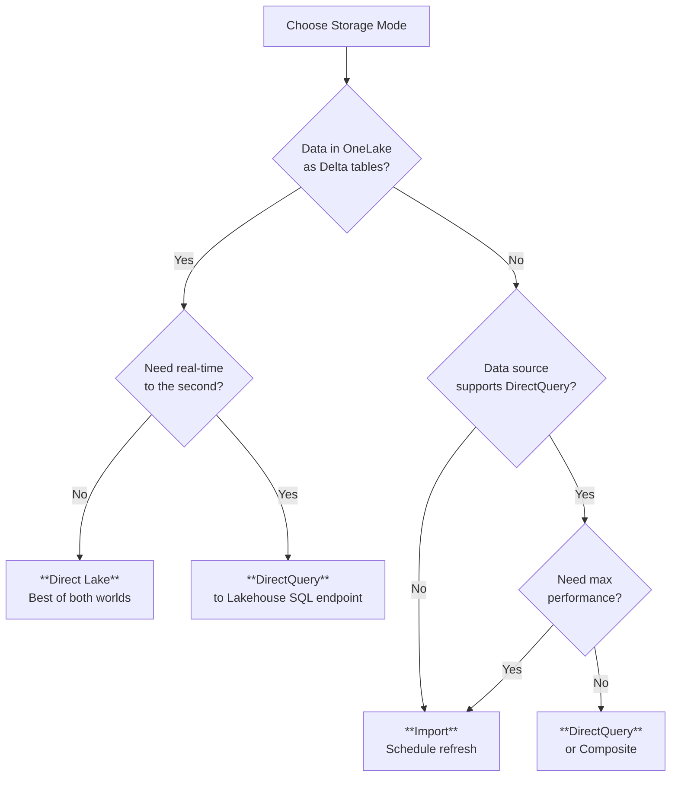
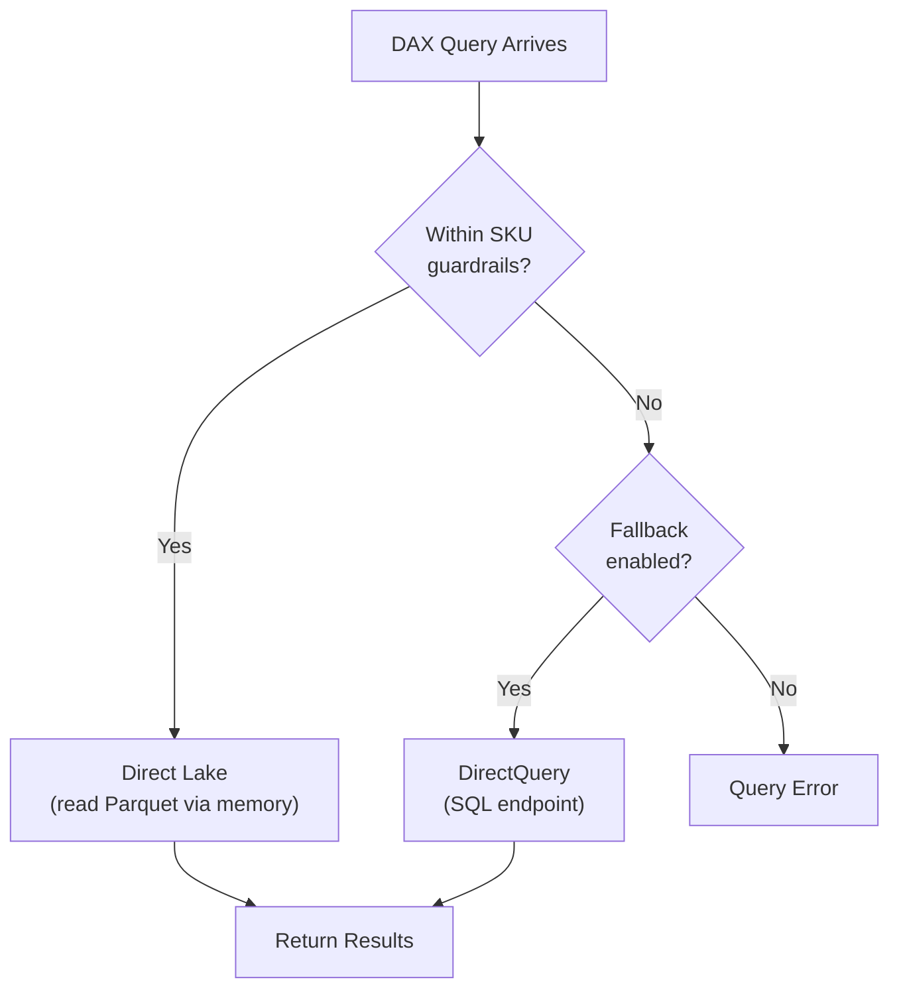

# ⚡ Quick Reference Cheatsheet
{: .no_toc }

> - Based on: *Microsoft Fabric documentation* (Microsoft Learn)
> - 📁 [← Back to Home](/dp-600-study-notes/)

Last-minute review sheet for the DP-600 Microsoft Fabric Analytics Engineer Associate exam. Print it, bookmark it, or skim it in the parking lot.
{: .fs-5 .fw-300 }

<details open markdown="block">
  <summary>Table of contents</summary>
  {: .text-delta }
- TOC
{:toc}
</details>

---

## 🔢 1 — Key Numbers & Limits

| Item | Value / Threshold |
|------|-------------------|
| Max tables per Direct Lake semantic model (F2) | 500 |
| Max tables per Direct Lake semantic model (F64+) | 1,000 |
| Max rows per table (Direct Lake, F2) | 300 million |
| Max rows per table (Direct Lake, F64) | 1.5 billion |
| Max columns per table (Direct Lake) | 500 |
| XMLA read/write endpoint requirement | **Premium / Fabric F64+** capacity (read available at lower SKUs) |
| Deployment pipeline stages (max) | **10** (Dev, Test, Prod, plus up to 7 custom stages) |
| Workspace roles | **4**: Admin, Member, Contributor, Viewer |
| Sensitivity labels — who can apply | Users with **Information Protection** license + label publishing policy |
| Incremental refresh — max partitions (Import) | **10,000** per table |
| Max measures in a single DAX query | Depends on memory; no hard cap but keep below **100** for performance |
| OneLake file format for Direct Lake | **Delta / Parquet (V-Order optimized)** |
| Max scheduled refreshes per day (Pro) | **8** |
| Max scheduled refreshes per day (Premium) | **48** |

> **Exam Tip:** SKU-specific guardrails (row limits, table counts) are the most common "trick number" questions. Know at least the F2 and F64 tiers.
{: .note }

---

## 💾 2 — Storage Mode Decision Matrix

| Criteria | Import | DirectQuery | Direct Lake | Composite |
|----------|--------|-------------|-------------|-----------|
| **Data freshness** | Scheduled / on-demand refresh | Real-time | Near real-time (framing) | Mixed |
| **Query performance** | Fastest (in-memory) | Depends on source | Fast (columnar from OneLake) | Varies by table |
| **Data volume** | Limited by capacity memory | No size limit | Guardrails per SKU | Mixed |
| **Data source** | Any supported | Any supported | **Delta tables in OneLake only** | Any mix |
| **DAX support** | Full | Full (slower) | Full (with fallback) | Full |
| **Use case** | Small-to-mid datasets, max perf | Enforce source RLS, large data | Fabric-native analytics | Migration, mixed sources |
| **Refresh needed?** | Yes | No | Framing only | Partial |



> **Exam Caveat:** Direct Lake is **only** available for Delta tables stored in OneLake (Lakehouse or Warehouse). If data is in Azure SQL or Synapse, you cannot use Direct Lake.
{: .warning }

---

## 📐 3 — DAX Quick Reference

### 🔧 CALCULATE & Filter Modifiers

| Pattern | What It Does | Example |
|---------|-------------|---------|
| `CALCULATE(expr, filter)` | Evaluates expression in modified filter context | `CALCULATE(SUM(Sales[Amount]), Product[Color]="Red")` |
| `ALL(table/col)` | Removes all filters from table or column | `CALCULATE(SUM(Sales[Amount]), ALL(Product))` |
| `ALLEXCEPT(table, col)` | Removes all filters except specified columns | `CALCULATE(…, ALLEXCEPT(Product, Product[Category]))` |
| `REMOVEFILTERS(col)` | Alias for ALL — clearer intent | `CALCULATE(…, REMOVEFILTERS(Date[Year]))` |
| `KEEPFILTERS(filter)` | Adds filter without overriding existing context | `CALCULATE(…, KEEPFILTERS(Product[Color]="Red"))` |

### 🔄 Iterators

| Function | Purpose |
|----------|---------|
| `SUMX(table, expr)` | Row-by-row sum |
| `AVERAGEX(table, expr)` | Row-by-row average |
| `COUNTX(table, expr)` | Count rows where expr is not blank |
| `RANKX(table, expr)` | Rank each row by expression |
| `MAXX / MINX` | Row-by-row max/min |

### 📊 Table Functions

| Function | Purpose |
|----------|---------|
| `FILTER(table, condition)` | Returns filtered table (iterator — slower) |
| `ADDCOLUMNS(table, name, expr)` | Adds calculated columns to a table expression |
| `SUMMARIZE(table, groupCol)` | Groups by column(s) — avoid adding measures here |
| `SUMMARIZECOLUMNS(col, filter, name, expr)` | Preferred for grouping + measures (optimized) |
| `SELECTCOLUMNS(table, name, expr)` | Projects specific columns |
| `DISTINCT(col)` | Unique values of a column |
| `VALUES(col)` | Unique values including blank row from broken relationships |

### ⏰ Time Intelligence

| Function | Purpose |
|----------|---------|
| `TOTALYTD(expr, dateCol)` | Year-to-date total |
| `TOTALQTD / TOTALMTD` | Quarter / month-to-date |
| `SAMEPERIODLASTYEAR(dateCol)` | Shifts dates back one year |
| `DATEADD(dateCol, -1, YEAR)` | Shifts dates by interval |
| `DATESYTD(dateCol)` | Returns dates from start of year to current date |
| `PARALLELPERIOD(dateCol, -1, QUARTER)` | Full parallel period |

> **Exam Caveat:** Time intelligence functions require a **contiguous Date table** marked as a date table. Gaps in dates break these functions.
{: .warning }

### 🪟 Windowing Functions (New in Fabric)

| Function | Purpose |
|----------|---------|
| `OFFSET(n, relation, orderBy)` | Access row N positions away |
| `WINDOW(from, to, relation, orderBy)` | Define a sliding window |
| `INDEX(n, relation, orderBy)` | Access the Nth row |

### 📌 Variables Pattern & USERELATIONSHIP

```dax
-- VAR / RETURN pattern (always prefer for readability & performance)
Profit Margin =
VAR TotalRevenue = SUM(Sales[Revenue])
VAR TotalCost   = SUM(Sales[Cost])
RETURN
    DIVIDE(TotalRevenue - TotalCost, TotalRevenue, 0)

-- USERELATIONSHIP for role-playing dimensions
Ship Date Sales =
CALCULATE(
    SUM(Sales[Amount]),
    USERELATIONSHIP(Sales[ShipDateKey], Date[DateKey])
)
```

> **Exam Tip:** `USERELATIONSHIP` activates an **inactive** relationship for that measure only. The relationship must already exist in the model as inactive.
{: .note }

---

## 🔒 4 — Security Layers Cheatsheet

| Layer | RLS (Row-Level Security) | CLS (Column-Level Security) | OLS (Object-Level Security) |
|-------|--------------------------|-----------------------------|-----------------------------|
| **What it restricts** | Rows visible to user | Columns visible to user | Tables or columns hidden from user |
| **Defined in** | Semantic model (DAX filter) | Semantic model (role config) | Semantic model (role config) |
| **Implementation** | DAX expression on table | Column permissions in role | `None` or `Read` metadata permission |
| **Tooling** | Power BI Desktop / XMLA / Tabular Editor | XMLA / Tabular Editor only | XMLA / Tabular Editor only |
| **Works with Direct Lake?** | ✅ | ✅ | ✅ |
| **Test method** | "View as Role" in service | XMLA query as role | XMLA query as role |

```mermaid
flowchart LR
    subgraph "Security Enforcement Stack"
        A["Workspace Roles<br/>(Admin, Member,<br/>Contributor, Viewer)"] --> B["Semantic Model<br/>RLS / CLS / OLS"]
        B --> C["Sensitivity Labels<br/>(Microsoft Purview)"]
    end
    style A fill:#1a3a5c,stroke:#4a9eff
    style B fill:#1a3a5c,stroke:#4a9eff
    style C fill:#1a3a5c,stroke:#4a9eff
```



> **Exam Caveat:** RLS is defined in the **semantic model**, NOT in the Lakehouse or Warehouse. Users with Admin/Member roles **bypass** RLS when browsing data in the service.
{: .warning }

---

## 🗄️ 5 — Data Store Selection

| Criteria | Lakehouse | Warehouse | KQL Database | Eventhouse |
|----------|-----------|-----------|--------------|------------|
| **Query language** | Spark SQL, PySpark | T-SQL | KQL (Kusto) | KQL |
| **File format** | Delta (Parquet) | Managed tables | Columnar time-series | Columnar time-series |
| **Best for** | Data engineering, ML, ELT | Enterprise BI, complex joins, stored procs | Log/telemetry analytics | Streaming + real-time analytics |
| **Schema** | Schema-on-read & schema-on-write | Schema-on-write (strict) | Semi-structured, schemaless | Semi-structured |
| **Transactions** | ACID via Delta | Full T-SQL transactions | Append-optimized | Append-optimized |
| **SQL endpoint?** | ✅ (read-only auto-generated) | Native | ❌ (KQL only) | ❌ (KQL only) |
| **Direct Lake support** | ✅ | ✅ | ❌ | ❌ |

> **Exam Tip:** If the question mentions **T-SQL stored procedures** or **views with complex joins**, the answer is **Warehouse**. If it mentions **streaming** or **IoT telemetry**, think **Eventhouse / KQL Database**.
{: .note }

---

## 📥 6 — Ingestion Method Selection

| Criteria | Dataflow Gen2 | Notebook (Spark) | Copy Activity (Pipeline) | Shortcut |
|----------|---------------|-------------------|--------------------------|----------|
| **Skill level** | Low-code (Power Query) | Pro-code (Python/Scala) | Low-code (config) | No-code |
| **Transformation** | ✅ (M / Power Query) | ✅ (full Spark) | Minimal (mapping only) | None (pass-through) |
| **Best for** | Simple transforms, small data | Complex ETL, ML prep, large data | Bulk copy between stores | Virtualized access, zero-copy |
| **Scheduling** | Pipeline or standalone | Pipeline | Pipeline | Always live |
| **Compute** | Fabric Dataflow compute | Spark pool | Pipeline IR | None |
| **Writes Delta?** | ✅ (to Lakehouse) | ✅ | ✅ | ❌ (reads in-place) |

> **Exam Caveat:** **Shortcuts** do not copy data — they create a virtualized reference. Data stays in the source (ADLS, S3, or another OneLake location). This is critical for questions about data residency and latency.
{: .warning }

---

## 🔷 7 — Direct Lake Deep Dive

### 📌 Key Facts

| Fact | Detail |
|------|--------|
| Required format | **Delta tables** with **V-Order** optimization |
| Where data lives | **OneLake** (Lakehouse or Warehouse) |
| Framing | Snapshot of Delta log metadata; determines which Parquet files to read |
| Refresh type | **Framing** (lightweight metadata update, not data copy) |
| Automatic framing | Occurs when Fabric detects schema/data changes |
| Fallback behavior | Falls back to **DirectQuery** when guardrails are exceeded |
| Fallback triggers | Row count exceeds SKU limit, column count exceeds limit, unsupported DAX, or timeout |
| Disable fallback | `DirectLakeBehavior = DontFallback` (query fails instead of going to DQ) |
| V-Order | Special sort order applied at write time; improves read performance dramatically |



> **Exam Caveat:** Direct Lake **does not import data** into the model. It reads Parquet files directly from OneLake into memory on demand. Framing is NOT the same as a refresh — it only updates the Delta log pointer.
{: .warning }

---

## ⚠️ 8 — Common Exam Traps

1. **RLS is defined in the semantic model**, not in the Lakehouse, Warehouse, or data source.
2. **Direct Lake requires Delta tables in OneLake** — no CSV, no Azure SQL, no external Parquet.
3. **Viewers cannot build reports** on shared semantic models without **Build permission**.
4. **Workspace Admin and Member roles bypass RLS** when browsing data directly in the service.
5. **XMLA read/write** requires at minimum **Power BI Premium Per User (PPU)** or **Fabric F64+** for write; read is available at lower SKUs.
6. **Deployment pipelines** compare content between stages — they do **not** version-control code (use Git integration for that).
7. **Incremental refresh** in Import mode creates partitions automatically — you configure the `RangeStart` and `RangeEnd` parameters, not partition logic.
8. **Sensitivity labels** require **Microsoft Purview Information Protection**; they propagate downstream when data is exported.
9. **SUMMARIZE should not be used to add new measure columns** — use `SUMMARIZECOLUMNS` or `ADDCOLUMNS(SUMMARIZE(...))` instead.
10. **Composite models** can mix Import and DirectQuery tables, but Direct Lake tables **cannot** be mixed with Import tables in the same model.
11. **Shortcuts are read-only** virtual references — they do not move, copy, or transform data.
12. **CLS and OLS cannot be configured in Power BI Desktop** — they require XMLA endpoint or Tabular Editor.
13. **Time intelligence functions require a Date table** marked as a date table with no gaps.
14. **V-Order** is a write-time optimization — it must be applied when data is written to Delta, not at query time.
15. **`KEEPFILTERS`** does not remove context; it **intersects** with existing filters. Contrast with `CALCULATE` which overrides.
16. **Direct Lake fallback to DirectQuery** uses the SQL analytics endpoint — if that endpoint is down, queries fail.
17. **Git integration** in Fabric works at the **workspace level**, not at individual item level.
18. **Dataflow Gen2** outputs to Lakehouse/Warehouse; it does **not** load directly into a semantic model like legacy Power BI dataflows could.
19. **`USERELATIONSHIP`** only works with **inactive** relationships — you cannot reference a relationship that does not exist.
20. **Large format datasets** (over 10 GB) require Premium or Fabric capacity — Pro licenses are capped.

> **Exam Tip:** When two answers both seem correct, ask yourself: "Where is this configured?" The exam loves testing whether something is set in the semantic model, the workspace, the data source, or the admin portal.
{: .note }

---

## ✅ 9 — Pre-Exam Checklist

### 🔒 Domain 1 — Maintain a Data Analytics Solution (25-30%)

- [ ] I can explain the four workspace roles and their permissions
- [ ] I know how deployment pipelines compare content across stages
- [ ] I understand Git integration scope (workspace-level, supported item types)
- [ ] I can configure sensitivity labels and explain downstream inheritance
- [ ] I know when to use XMLA endpoints and which SKUs support read vs. read/write
- [ ] I can describe the difference between RLS, CLS, and OLS and where each is configured
- [ ] I understand how workspace Admin/Member roles interact with RLS

### 🔄 Domain 2 — Prepare Data (45-50%)

- [ ] I can choose between Lakehouse, Warehouse, KQL Database, and Eventhouse
- [ ] I know when to use Dataflow Gen2 vs. Notebook vs. Pipeline Copy Activity vs. Shortcut
- [ ] I can design a star schema with fact and dimension tables
- [ ] I understand how Shortcuts work and their limitations (read-only, no transformation)
- [ ] I can write basic Spark SQL, T-SQL, and KQL queries
- [ ] I know the incremental refresh parameter pattern (`RangeStart` / `RangeEnd`)
- [ ] I can describe Delta Lake format, V-Order, and their role in Direct Lake

### 📐 Domain 3 — Implement and Manage Semantic Models (25-30%)

- [ ] I can choose between Import, DirectQuery, Direct Lake, and Composite storage modes
- [ ] I know the Direct Lake guardrails, framing process, and fallback behavior
- [ ] I can write CALCULATE with ALL, ALLEXCEPT, REMOVEFILTERS, and KEEPFILTERS
- [ ] I understand iterator functions (SUMX, AVERAGEX, COUNTX, RANKX)
- [ ] I know when to use SUMMARIZECOLUMNS vs. SUMMARIZE
- [ ] I can implement time intelligence with a proper Date table
- [ ] I understand USERELATIONSHIP for role-playing dimensions
- [ ] I can configure RLS with DAX and test it with "View as Role"
- [ ] I know how to optimize a model (remove unused columns, avoid bi-directional filters, use variables)

---

> **Exam Tip:** The DP-600 is heavily weighted toward **Domain 2 (Prepare Data)** at 45-50%. Spend the most study time on data ingestion patterns, star schema design, and query languages.
{: .note }

---

[← 03 — Implement and Manage Semantic Models](/dp-600-study-notes/03-implement-manage-semantic-models/) | [Back to Home →](/dp-600-study-notes/)