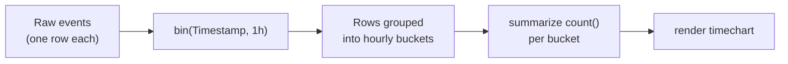

# 🔎 Appendix A — KQL Reference & Exam Caveats
{: .no_toc }

> - Based on: *Kusto Query Language documentation* (Microsoft Learn)
> - 📁 [← Back to Home](/dp-600-study-notes/)

Focused syntax reference for **KQL (Kusto Query Language)** as it appears on the DP-600 exam. KQL powers Eventhouse, KQL Databases, and Real-Time Analytics in Fabric. You will not be asked to write long queries, but you **will** be asked to read a query and pick the correct operator, order, or result.
{: .fs-5 .fw-300 }

<details open markdown="block">
  <summary>Table of contents</summary>
  {: .text-delta }
- TOC
{:toc}
</details>

---

## 🧭 1 — Where KQL Shows Up in Fabric

| Surface | Uses KQL? | Notes |
|---------|-----------|-------|
| **KQL Database** | ✅ Native | Stored in an Eventhouse; columnar, time-series optimized |
| **Eventhouse** | ✅ Native | Container for one or more KQL Databases |
| **KQL Queryset** | ✅ | Saved `.kql` queries + results, shareable |
| **Real-Time Dashboard** | ✅ | Tiles are backed by KQL queries |
| **Lakehouse / Warehouse** | ❌ | Use Spark SQL / T-SQL instead |
| **Semantic model (DAX)** | ❌ | KQL results can *feed* a model, but the model queries in DAX |

> **Exam Caveat:** KQL is **read-optimized for append-only, high-volume, time-stamped data** (logs, telemetry, IoT). If a scenario mentions frequent **updates or deletes** of individual rows, KQL is the wrong store — point to a Warehouse or Lakehouse instead.
{: .warning }

---

## 🔧 2 — Core Query Structure

A KQL query starts with a **table name** and pipes (`|`) data through a sequence of **tabular operators**. Data flows left to right, top to bottom.

```kql
StormEvents                          // 1. source table
| where StartTime > ago(7d)          // 2. filter rows
| where State == "FLORIDA"           // 3. filter again (AND)
| summarize Count = count() by EventType   // 4. aggregate
| sort by Count desc                 // 5. order
| take 10                            // 6. limit
```

> **Key Point:** Order matters. `where` **before** `summarize` filters raw rows (fast, uses indexes). `where` **after** `summarize` filters aggregated results. Filtering early is both correct semantics *and* the performant choice — a common exam distractor puts the filter after the aggregation.
{: .note }

---

## 🎛️ 3 — Filtering & Row Operators

| Operator | Purpose | Example |
|----------|---------|---------|
| `where` | Filter rows on a predicate | `\| where Level == "Error"` |
| `take` / `limit` | Return N rows (no ordering guarantee) | `\| take 100` |
| `top` | Top N rows **by** a column (sorts) | `\| top 5 by Duration desc` |
| `sort by` / `order by` | Sort rows | `\| sort by Timestamp asc` |
| `distinct` | Unique combinations of columns | `\| distinct DeviceId, City` |
| `project` | Select / rename / compute columns | `\| project City, Temp = TempC` |
| `project-away` | Drop specific columns | `\| project-away _internalId` |
| `project-keep` | Keep only matching columns | `\| project-keep City*, Temp` |
| `extend` | Add a **new** calculated column | `\| extend TempF = TempC * 9/5 + 32` |

> **Exam Caveat:** `project` **replaces** the column set — anything not listed is dropped. `extend` **adds** a column and keeps everything else. Mixing these up is the single most common KQL trap: if a later operator references a column, make sure a `project` didn't already remove it.
{: .warning }

### String operators (case sensitivity)

| Operator | Case-sensitive? | Meaning |
|----------|-----------------|---------|
| `==` | ✅ Yes | Exact match |
| `=~` | ❌ No | Case-insensitive equals |
| `has` | ❌ No | Whole-term match (indexed, **fast**) |
| `contains` | ❌ No | Substring match (**not** indexed, slower) |
| `startswith` / `endswith` | ❌ No | Prefix / suffix |
| `matches regex` | ✅ Yes | Regular expression |

> **Exam Tip:** Prefer `has` over `contains` when matching a full word/term — `has` uses the term index and is dramatically faster on large tables. `contains` scans and should be reserved for genuine substring needs.
{: .note }

---

## 📊 4 — Aggregation with `summarize`

`summarize` groups rows and computes aggregates. Columns after `by` become the grouping keys.

```kql
Telemetry
| summarize
    AvgTemp   = avg(Temperature),
    MaxTemp   = max(Temperature),
    Readings  = count()
  by DeviceId, bin(Timestamp, 1h)     // group per device, per hour
```

| Aggregation function | Returns |
|----------------------|---------|
| `count()` | Row count |
| `dcount(col)` | Approx. distinct count (fast, ~1% error) |
| `countif(pred)` | Count where predicate is true |
| `sum(col)` / `avg(col)` | Sum / average |
| `min(col)` / `max(col)` | Extremes |
| `percentile(col, 95)` | Nth percentile |
| `make_list(col)` / `make_set(col)` | Aggregate values into an array |
| `arg_max(col, *)` | Row with the max of `col` (keep all columns) |

> **Exam Caveat:** `count()` takes **no argument**; `count(col)` is invalid KQL (unlike T-SQL's `COUNT(col)`). To count non-nulls of a column use `countif(isnotnull(col))`. And `dcount()` is **approximate** by design — if a scenario demands an exact distinct count, use `count()` over a `distinct` result, not `dcount()`.
{: .warning }

---

## ⏱️ 5 — Time-Series & the `bin()` Function

Time-bucketing is the heart of KQL. `bin()` (alias `floor`) rounds a value down to the nearest multiple — most often a time interval.

```kql
Signups
| where Timestamp > ago(30d)
| summarize DailyUsers = dcount(UserId) by bin(Timestamp, 1d)
| render timechart
```

| Expression | Meaning |
|------------|---------|
| `ago(7d)` | Timestamp 7 days before now |
| `now()` | Current UTC time |
| `bin(T, 1h)` | Round T down to the hour |
| `datetime_diff("day", end, start)` | Whole units between two datetimes |
| `startofday(T)` / `startofmonth(T)` | Truncate to boundary |
| `todatetime("2026-01-01")` | Parse to datetime |
| `format_datetime(T, "yyyy-MM-dd")` | Format as string |

Time units: `d` (day), `h` (hour), `m` (minute), `s` (second), `ms`, `microsecond`, `tick`. There is **no** `w`, `M`, or `y` literal — use functions like `startofweek()` / `startofmonth()` for those.

> **Exam Caveat:** All KQL datetimes are **UTC**. There is no time-zone-aware datetime type. Convert for display only, and remember `ago()` / `now()` are UTC — a scenario about "yesterday in local time" needs an explicit offset.
{: .warning }



---

## 🔗 6 — Joins & Lookups

| Operator | Use when | Notes |
|----------|----------|-------|
| `join kind=inner` | Match rows in both tables | **Default kind is `innerunique`, not `inner`** |
| `join kind=leftouter` | Keep all left rows | Right columns null when no match |
| `lookup` | Enrich from a small dimension table | Optimized for dimension lookups |
| `union` | Stack rows from multiple tables | Columns unioned by name |

```kql
Sales
| join kind=inner (
    Products
    | project ProductId, Category
  ) on ProductId
```

> **Exam Caveat:** KQL's **default join is `innerunique`** — it de-duplicates the left-side key before joining, which can silently drop rows compared to a SQL `INNER JOIN`. If you need true SQL inner-join semantics, you must write `kind=inner` explicitly. This is a favourite "spot the subtle bug" question.
{: .warning }

> **Exam Tip:** For **best join performance**, put the **smaller table on the left** side of `join`. This is the opposite instinct from some SQL engines — KQL broadcasts the left table.
{: .note }

---

## 🧱 7 — Variables, Functions & `render`

```kql
let threshold = 100;                       // scalar variable
let RecentErrors =                         // tabular variable
    Logs | where Level == "Error" and Timestamp > ago(1d);
RecentErrors
| where Count > threshold
| render columnchart
```

- `let` binds a name to a **scalar or a whole table**. Statements are separated by `;` and the **final** statement produces the result.
- `render` is a **client-side visualization** hint (`timechart`, `barchart`, `columnchart`, `piechart`, `table`). It does not change the data.

> **Exam Caveat:** `render` only affects how a result is *drawn* in a KQL queryset or dashboard tile — it produces no new columns and cannot be consumed downstream. A question implying `render` transforms or filters data is wrong.
{: .warning }

---

## 📥 8 — Ingestion & Materialized Views (know the concepts)

| Concept | What to know for the exam |
|---------|---------------------------|
| **Update policy** | Runs a KQL transform automatically on ingestion (source table → target table) |
| **Materialized view** | Pre-aggregated, always-current view over a source table (e.g. hourly rollups) |
| **`.ingest`** | Management command to load data (batch or streaming) |
| **Retention / caching policy** | Controls how long data is kept vs. how much is hot-cached in memory |
| **OneLake availability** | A KQL Database can mirror its data to OneLake as Delta for cross-engine access |

> **Exam Tip:** Management commands start with a **dot** (`.create table`, `.ingest`, `.alter`). Anything starting with `.` is a **control command**, not a query — you cannot pipe query operators into it.
{: .note }

---

## ⚠️ 9 — KQL Exam Traps (Rapid Fire)

1. **`project` replaces columns; `extend` adds them** — the #1 source of "column not found" distractors.
2. **`count()` takes no argument** — `count(col)` is invalid; use `countif(isnotnull(col))`.
3. **Default `join` is `innerunique`**, which de-dupes the left key — specify `kind=inner` for SQL-style joins.
4. **`dcount()` is approximate** — use `distinct` + `count()` when exactness is required.
5. **`has` is indexed and fast; `contains` scans** — prefer `has` for whole-term matches.
6. **All datetimes are UTC** — no time-zone type; `ago()`/`now()` are UTC.
7. **`==` is case-sensitive; `=~` is not** — a common cause of "why is my filter empty" scenarios.
8. **Filter (`where`) before `summarize`** for correctness and performance.
9. **Put the smaller table on the left of a `join`** for performance.
10. **Control commands start with `.`** and are not part of the tabular query pipeline.
11. **KQL is append-optimized** — update/delete-heavy workloads belong in Warehouse/Lakehouse, not a KQL Database.
12. **`render` is display-only** — it never reshapes or filters the result set.

> **Exam Tip:** When a KQL item shows a full query and asks for the result, trace the **pipe order** carefully: figure out the column set after each `project`/`extend`, then confirm every later operator's referenced columns still exist.
{: .note }

---

## 🧾 10 — KQL ↔ T-SQL Quick Translation

| Intent | T-SQL | KQL |
|--------|-------|-----|
| Filter | `WHERE x = 1` | `\| where x == 1` |
| Select columns | `SELECT a, b` | `\| project a, b` |
| Add column | `SELECT *, a+b AS c` | `\| extend c = a + b` |
| Group & aggregate | `GROUP BY g` | `\| summarize ... by g` |
| Sort | `ORDER BY c DESC` | `\| sort by c desc` |
| Top N | `SELECT TOP 5 ... ORDER BY` | `\| top 5 by c desc` |
| Distinct | `SELECT DISTINCT a` | `\| distinct a` |
| Count rows | `COUNT(*)` | `count()` |

> **Exam Caveat:** KQL uses `==` for equality (single `=` is assignment inside `project`/`extend`/`summarize`). Writing `where x = 1` is a syntax error, not a filter.
{: .warning }

---

[← 04 — Quick Reference Cheatsheet](/dp-600-study-notes/04-quick-reference-cheatsheet/) | [Appendix B — DAX Reference →](/dp-600-study-notes/06-appendix-dax-reference/)
