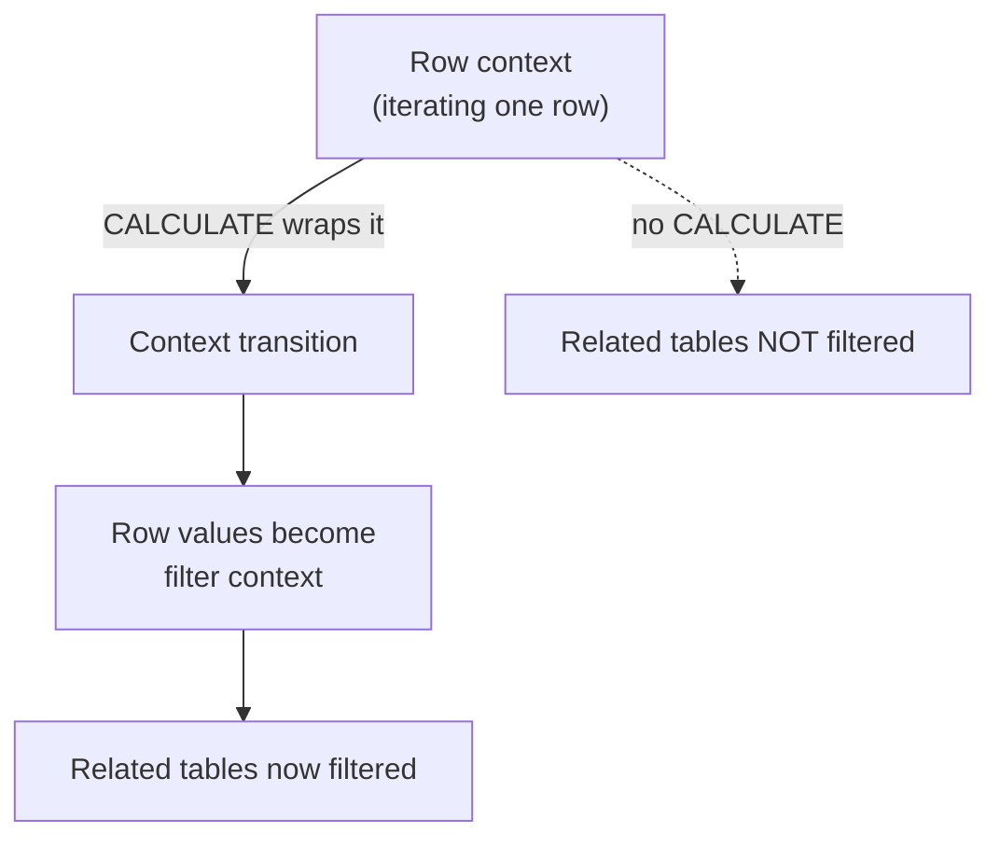

# 📐 Appendix B — DAX Reference & Exam Caveats
{: .no_toc }

> - Based on: *DAX function reference* (Microsoft Learn)
> - 📁 [← Back to Home](/dp-600-study-notes/)

Syntax and semantics reference for **DAX (Data Analysis Expressions)** as tested on DP-600. The exam rarely asks you to author complex measures from scratch — it asks you to **read a measure and predict its value**, or pick the function that produces a required behaviour. Evaluation context is where almost every hard question lives.
{: .fs-5 .fw-300 }

<details open markdown="block">
  <summary>Table of contents</summary>
  {: .text-delta }
- TOC
{:toc}
</details>

---

## 🧠 1 — The One Concept That Matters: Evaluation Context

Every DAX expression is evaluated inside a **context**. There are two, and they combine.

| Context | Created by | What it does |
|---------|-----------|--------------|
| **Filter context** | Slicers, rows/columns of a visual, `CALCULATE` filters, RLS | Restricts *which rows* of the model are visible |
| **Row context** | Calculated columns, iterators (`SUMX`, `FILTER`, …) | Points at *one row at a time*; does **not** filter other tables |

> **Key Point:** Row context does **not** automatically filter related tables — that only happens through **context transition**, which is triggered by `CALCULATE` (or a measure reference, which wraps in an implicit `CALCULATE`). This single rule explains most "why is my number wrong?" exam questions.
{: .note }



---

## ⚙️ 2 — Measures vs. Calculated Columns

| | Calculated Column | Measure |
|---|-------------------|---------|
| **Evaluated** | At refresh, row by row | At query time, per visual cell |
| **Context** | Row context | Filter context |
| **Stored?** | ✅ Materialized in the model (uses memory) | ❌ Computed on demand |
| **Use for** | Row-level attributes, relationships, slicer fields | Aggregations, KPIs, ratios |

> **Exam Caveat:** Prefer **measures** over calculated columns for aggregations. Calculated columns consume memory and are computed at refresh, bloating the model — a calculated column that just sums or averages is almost always the wrong design. Calculated columns are appropriate only when you need a physical, row-level value (e.g. a category to slice by or a relationship key).
{: .warning }

---

## 🎯 3 — CALCULATE: The Most Important Function

`CALCULATE(<expression>, <filter1>, <filter2>, …)` evaluates the expression in a **modified** filter context.

```dax
Red Sales =
CALCULATE(
    SUM(Sales[Amount]),
    Product[Color] = "Red"        // adds/overrides filter on Color
)
```

**Rules of `CALCULATE`:**
1. Filter arguments **override** any existing filter on the same column (unless wrapped in `KEEPFILTERS`).
2. It triggers **context transition**: any row context becomes filter context.
3. Filter arguments are Boolean or table expressions; multiple filters combine with **AND**.

| Modifier | Effect |
|----------|--------|
| `ALL(table/col)` | Remove filters (see §4) |
| `REMOVEFILTERS(...)` | Explicit "remove filters" — clearer than `ALL` as a modifier |
| `KEEPFILTERS(...)` | Add a filter **without** overriding existing context |
| `ALLEXCEPT(t, cols)` | Remove all filters on `t` except the listed columns |
| `USERELATIONSHIP(c1, c2)` | Activate an inactive relationship for this evaluation |
| `CROSSFILTER(c1, c2, dir)` | Change relationship cross-filter direction |

> **Exam Caveat:** A plain filter argument like `Product[Color]="Red"` **replaces** the existing filter on `Color`. To *narrow* the current selection instead of replacing it, wrap it in `KEEPFILTERS`. Confusing "override" vs. "intersect" is a top-tier DAX trap.
{: .warning }

---

## 🧹 4 — Filter-Removing Functions

| Function | Removes filters from | Returns a table? | Typical use |
|----------|----------------------|------------------|-------------|
| `ALL(Table)` | Entire table | ✅ | % of grand total |
| `ALL(Table[Col])` | One column | ✅ | % within other dims |
| `ALLEXCEPT(Table, Col)` | All columns **except** listed | ✅ | Keep grouping level |
| `ALLSELECTED()` | Back to outer/slicer selection | ✅ | % of visible total |
| `REMOVEFILTERS()` | Same as `ALL`, but **modifier-only** intent | ✅ | Clarity inside `CALCULATE` |

```dax
% of Total =
DIVIDE(
    SUM(Sales[Amount]),
    CALCULATE(SUM(Sales[Amount]), ALL(Sales))
)
```

> **Exam Tip:** `ALLSELECTED()` respects the user's **slicer/outer** selection but ignores the current row's filter — it's the function for "% of visible total." `ALL()` ignores *everything*, giving "% of grand total." Questions about subtotal/percentage behaviour hinge on this distinction.
{: .note }

---

## 🔁 5 — Iterators (the "X" Functions)

Iterators walk a table **row by row** (creating row context), evaluate an expression per row, then aggregate.

| Iterator | Aggregates | Note |
|----------|-----------|------|
| `SUMX(t, expr)` | Sum | Row-level math then sum (e.g. qty × price) |
| `AVERAGEX(t, expr)` | Average | |
| `COUNTX(t, expr)` | Count of non-blank | |
| `MAXX` / `MINX` | Max / Min | |
| `RANKX(t, expr, …)` | Rank | Watch ties and `ASC`/`DESC` |
| `CONCATENATEX(t, expr, delim)` | String join | For display lists |

```dax
Revenue = SUMX(Sales, Sales[Qty] * Sales[UnitPrice])
```

> **Exam Caveat:** `SUM(Sales[Qty] * Sales[UnitPrice])` is **invalid** — `SUM` takes a single column, not an expression. Row-by-row math requires an **iterator** (`SUMX`). Recognising when a scenario needs `SUMX` vs `SUM` is a recurring question.
{: .warning }

---

## 🗓️ 6 — Time Intelligence

Time-intelligence functions require a proper **Date table**: contiguous dates (no gaps), full years, and **Mark as Date Table** set.

| Function | Purpose |
|----------|---------|
| `TOTALYTD(expr, Date[Date])` | Year-to-date |
| `TOTALQTD` / `TOTALMTD` | Quarter / month-to-date |
| `SAMEPERIODLASTYEAR(Date[Date])` | Shift back exactly one year |
| `DATEADD(Date[Date], -1, MONTH)` | Shift by an interval |
| `DATESYTD(Date[Date])` | Table of dates YTD |
| `PARALLELPERIOD(Date[Date], -1, QUARTER)` | Full prior period |
| `PREVIOUSMONTH` / `PREVIOUSYEAR` | Complete prior period as a table |

```dax
Sales PY =
CALCULATE(
    SUM(Sales[Amount]),
    SAMEPERIODLASTYEAR(Date[Date])
)
```

> **Exam Caveat:** Time intelligence **breaks with gaps** in the Date table or if it isn't marked as a date table. `SAMEPERIODLASTYEAR` needs a **contiguous** range; a fact table's own date column is not a substitute for a dedicated, marked Date dimension.
{: .warning }

---

## 🪟 7 — Window Functions (Fabric-era DAX)

Newer visual-calc / window functions that appear on the updated exam:

| Function | Purpose |
|----------|---------|
| `OFFSET(delta, relation, orderBy)` | Row N positions away (prev/next) |
| `WINDOW(from, to, …)` | A sliding window of rows |
| `INDEX(position, relation, orderBy)` | The Nth row (e.g. first/last) |
| `RANK` / `ROWNUMBER` | Ranking within a partition |

> **Exam Tip:** `OFFSET` and `WINDOW` are the modern replacement for awkward `EARLIER`/`FILTER` gymnastics for period-over-period and running-total scenarios. If a question offers a clean `OFFSET`-based answer against a convoluted alternative, the window function is usually intended.
{: .note }

---

## 📌 8 — Variables (VAR / RETURN)

```dax
Profit Margin =
VAR Revenue = SUM(Sales[Revenue])
VAR Cost    = SUM(Sales[Cost])
RETURN
    DIVIDE(Revenue - Cost, Revenue, 0)
```

- Variables are **evaluated once**, where they are declared, and are **immutable**.
- A variable captures the **context at its declaration point**, *not* where it's used.

> **Exam Caveat:** A `VAR` is evaluated **at declaration, in the context that exists there** — later `CALCULATE` modifications do **not** change its value. This "variables are constants" behaviour is deliberately tested: code that expects a variable to react to a modified filter context is wrong.
{: .warning }

> **Exam Tip:** Variables improve readability *and* performance (no re-evaluation), and using them is the safe answer whenever a repeated sub-expression appears in a measure.
{: .note }

---

## ➗ 9 — Safe Patterns & Handy Functions

| Function | Why it matters |
|----------|----------------|
| `DIVIDE(num, den, [alt])` | Safe division — returns `alt` (default blank) instead of a divide-by-zero error |
| `COALESCE(a, b, …)` | First non-blank value |
| `SELECTEDVALUE(col, [alt])` | Value if exactly one is in context, else `alt` — safer than `VALUES` returning a table |
| `HASONEVALUE(col)` | Test single selection (for subtotal handling) |
| `ISINSCOPE(col)` | Detect grouping level in a matrix |
| `TREATAS(table, col)` | Apply a virtual relationship / filter |

> **Exam Caveat:** Use `DIVIDE()` rather than the `/` operator when the denominator can be zero or blank — `/` raises an error (or `Infinity`), while `DIVIDE` returns blank or your supplied alternate. Questions about "handle divide-by-zero gracefully" want `DIVIDE`.
{: .warning }

---

## 🧮 10 — SUMMARIZE vs. SUMMARIZECOLUMNS

| | `SUMMARIZE` | `SUMMARIZECOLUMNS` |
|---|-------------|--------------------|
| Grouping | ✅ | ✅ |
| Adding measures | ⚠️ Discouraged (context bugs) | ✅ Optimized |
| Auto-removes empty rows | ❌ | ✅ |
| Recommended for | Grouping keys only | Grouping **+** aggregation |

```dax
// Preferred
EVALUATE
SUMMARIZECOLUMNS(
    Product[Category],
    "Total Sales", SUM(Sales[Amount])
)
```

> **Exam Caveat:** Do **not** add measure columns inside `SUMMARIZE` — it can produce incorrect results due to context issues. Use `SUMMARIZECOLUMNS`, or `ADDCOLUMNS(SUMMARIZE(...), ...)`, when you need grouping plus calculated values.
{: .warning }

---

## ⚠️ 11 — DAX Exam Traps (Rapid Fire)

1. **Row context ≠ filter context.** Iterators create row context; only `CALCULATE` (or a measure reference) transitions it into a filter.
2. **`CALCULATE` filters override** same-column filters — use `KEEPFILTERS` to intersect instead.
3. **`SUM(a * b)` is invalid** — use `SUMX` for row-by-row math.
4. **`VAR` is evaluated once at declaration** and never reacts to later context changes.
5. **`ALL` = grand total; `ALLSELECTED` = visible total.** Pick by what the % should be "of."
6. **Time intelligence needs a contiguous, marked Date table** — gaps break it.
7. **Prefer measures over calculated columns** for aggregations (memory + refresh cost).
8. **`DIVIDE` over `/`** for safe divide-by-zero handling.
9. **Don't add measures inside `SUMMARIZE`** — use `SUMMARIZECOLUMNS`.
10. **`USERELATIONSHIP` needs an existing inactive relationship** — it activates, it does not create.
11. **`SELECTEDVALUE` beats `VALUES`** when you expect a single value — no error on multiple, returns your alternate.
12. **`KEEPFILTERS` intersects; `CALCULATE`'s bare filter replaces** — the same distinction as trap #2, restated because it appears constantly.
13. **Blank propagation:** blanks are ignored by `SUM`/`AVERAGE` but treated as 0 in some arithmetic — watch averages over blanks.
14. **Bi-directional relationships** can cause ambiguity and slow queries — single-direction + `CROSSFILTER`/`TREATAS` is the exam-preferred pattern.

> **Exam Tip:** For "predict the value" questions, write out the filter context of the target cell first, then apply each `CALCULATE`/iterator step in order. Most wrong answers come from forgetting context transition or assuming a filter intersects when it actually overrides.
{: .note }

---

## 🧾 12 — Reading a Measure Fast (Checklist)

- [ ] What is the **filter context** of this cell (slicers, row/column headers)?
- [ ] Does an **iterator** introduce row context? Over which table?
- [ ] Is there a **`CALCULATE`** (or measure ref) causing **context transition**?
- [ ] Do filter arguments **override** or **intersect** (`KEEPFILTERS`)?
- [ ] Are any filters **removed** (`ALL` / `ALLEXCEPT` / `ALLSELECTED`)?
- [ ] Are **`VAR`s** capturing context at declaration (constant thereafter)?
- [ ] Any **time-intelligence** that assumes a valid Date table?

---

[← Appendix A — KQL Reference](/dp-600-study-notes/05-appendix-kql-reference/) | [Appendix C — SQL Reference →](/dp-600-study-notes/07-appendix-sql-reference/)
