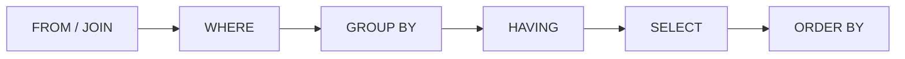

# 🧮 Appendix C — SQL Reference & Exam Caveats
{: .no_toc }

> - Based on: *Fabric Data Warehouse T-SQL surface area* (Microsoft Learn)
> - 📁 [← Back to Home](/dp-600-study-notes/)

Syntax reference for **T-SQL** as it is tested on DP-600. In Fabric, T-SQL is the language of the **Warehouse** and the **SQL analytics endpoint** of a Lakehouse. The exam tests *which surface supports what*, the Fabric-specific T-SQL limitations, and reading a query to predict its result — not writing production ETL by hand.
{: .fs-5 .fw-300 }

<details open markdown="block">
  <summary>Table of contents</summary>
  {: .text-delta }
- TOC
{:toc}
</details>

---

## 🧭 1 — Where T-SQL Shows Up in Fabric

| Surface | T-SQL support | Read / Write |
|---------|---------------|--------------|
| **Warehouse** | Full Fabric T-SQL surface | **Read + Write** (DDL & DML) |
| **Lakehouse SQL analytics endpoint** | Query subset | **Read-only** (`SELECT`, views, functions) |
| **KQL Database** | ❌ (uses KQL) | — |
| **Notebook (Spark)** | ❌ T-SQL — uses **Spark SQL** | Read + Write |
| **Semantic model** | ❌ (uses DAX) | — |

> **Exam Caveat:** The **SQL analytics endpoint** over a Lakehouse is **read-only** — you cannot `INSERT`, `UPDATE`, `DELETE`, or `CREATE TABLE` through it. To write with T-SQL you need a **Warehouse**. To write to Lakehouse tables, use Spark, Dataflows, or Pipelines. This read-only-vs-writable split is a top exam trap.
{: .warning }

> **Exam Caveat:** **Spark SQL ≠ T-SQL.** A Notebook uses Spark SQL (`CREATE TABLE ... USING DELTA`, `df.createOrReplaceTempView`), not T-SQL. Questions mixing `COPY INTO` or `CTAS` T-SQL syntax into a Notebook context are wrong — that syntax belongs to the Warehouse.
{: .warning }

---

## 🔧 2 — Query Fundamentals

```sql
SELECT
    p.Category,
    SUM(s.Amount)  AS TotalSales,
    COUNT(*)       AS OrderCount
FROM dbo.Sales AS s
INNER JOIN dbo.Product AS p
    ON s.ProductId = p.ProductId
WHERE s.OrderDate >= '2026-01-01'
GROUP BY p.Category
HAVING SUM(s.Amount) > 10000
ORDER BY TotalSales DESC;
```

**Logical processing order** (why you can't use a `SELECT` alias in `WHERE`):



> **Exam Caveat:** `WHERE` filters **rows before** grouping; `HAVING` filters **groups after** aggregation. You cannot reference an aggregate (e.g. `SUM(...)`) in `WHERE`, and you cannot reference a `SELECT` column alias in `WHERE`/`GROUP BY/HAVING` (only in `ORDER BY`) — because `SELECT` runs almost last.
{: .warning }

---

## 🔗 3 — Joins

| Join | Returns |
|------|---------|
| `INNER JOIN` | Only matching rows in both tables |
| `LEFT [OUTER] JOIN` | All left rows; NULLs where no right match |
| `RIGHT [OUTER] JOIN` | All right rows; NULLs where no left match |
| `FULL [OUTER] JOIN` | All rows from both; NULLs on either side |
| `CROSS JOIN` | Cartesian product (every combination) |

> **Exam Tip:** To find rows in A **with no match** in B, use `LEFT JOIN ... WHERE b.Key IS NULL` (an anti-join). A plain `INNER JOIN` can never surface unmatched rows — a common "how do I find missing records" distractor.
{: .note }

> **Exam Caveat:** Fabric Warehouse **does not enforce PRIMARY KEY / FOREIGN KEY / UNIQUE constraints** — they can be declared only as `NOT ENFORCED` (metadata for the optimizer). Duplicate or orphaned keys are *not* blocked, so joins can fan out unexpectedly. Never assume referential integrity is guaranteed by the engine.
{: .warning }

---

## 🏗️ 4 — Creating & Loading Tables (Warehouse)

| Technique | Purpose | Syntax shape |
|-----------|---------|--------------|
| **CTAS** | Create a table from a query result | `CREATE TABLE t AS SELECT ...` |
| **INSERT ... SELECT** | Append into an existing table | `INSERT INTO t SELECT ...` |
| **COPY INTO** | High-throughput bulk load from files | `COPY INTO t FROM 'https://.../*.parquet'` |
| **CREATE TABLE** | Define an empty table (DDL) | `CREATE TABLE t (Col INT, ...)` |

```sql
-- CTAS: create + populate in one statement
CREATE TABLE dbo.SalesSummary AS
SELECT Category, SUM(Amount) AS Total
FROM dbo.Sales
GROUP BY Category;

-- COPY INTO: fastest bulk ingestion from OneLake / ADLS / S3
COPY INTO dbo.Sales
FROM 'https://onelake.../Files/sales/*.parquet'
WITH (FILE_TYPE = 'PARQUET');
```

> **Exam Tip:** `COPY INTO` is the **recommended high-throughput** way to bulk-load files into a Warehouse table. `CTAS` is best for transforming/materializing query results into a new table. Both are Warehouse-only (write) operations.
{: .note }

> **Exam Caveat:** Fabric Warehouse tables **do not support `IDENTITY` columns** or auto-increment keys, and there is **no `MERGE`** for a long time — check the current surface, but the exam still leans on generating surrogate keys with `ROW_NUMBER()` rather than `IDENTITY`.
{: .warning }

---

## 👁️ 5 — Views, CTEs & Temp Tables

```sql
-- View: stored SELECT, no data of its own
CREATE VIEW dbo.vTopProducts AS
SELECT ProductId, SUM(Amount) AS Total
FROM dbo.Sales GROUP BY ProductId;

-- CTE: named, throwaway result set for the next statement only
WITH Ranked AS (
    SELECT ProductId, Amount,
           ROW_NUMBER() OVER (PARTITION BY ProductId ORDER BY Amount DESC) AS rn
    FROM dbo.Sales
)
SELECT * FROM Ranked WHERE rn = 1;
```

| Object | Persisted? | Scope |
|--------|-----------|-------|
| **View** | Definition only (no data) | Permanent, reusable |
| **CTE** (`WITH`) | ❌ | Single statement that follows it |
| **`#temp` table** | Session-scoped data | Current session |

> **Exam Caveat:** A **CTE exists only for the single statement immediately after it** — you cannot reference a CTE in a second, separate query. For reuse across statements use a **view** or a temp table. Also, the SQL analytics endpoint allows creating **views and functions** (metadata) even though it's read-only for data.
{: .warning }

---

## 🪟 6 — Window Functions

Window functions compute across a set of rows **without collapsing** them (unlike `GROUP BY`).

| Function | Purpose |
|----------|---------|
| `ROW_NUMBER()` | Unique sequential number per partition |
| `RANK()` / `DENSE_RANK()` | Ranking (with / without gaps on ties) |
| `SUM() OVER (...)` | Running / partitioned total |
| `LAG() / LEAD()` | Previous / next row's value |
| `NTILE(n)` | Split rows into n buckets |

```sql
SELECT
    OrderDate, Amount,
    SUM(Amount) OVER (ORDER BY OrderDate
        ROWS BETWEEN UNBOUNDED PRECEDING AND CURRENT ROW) AS RunningTotal,
    LAG(Amount) OVER (ORDER BY OrderDate) AS PrevAmount
FROM dbo.Sales;
```

> **Exam Tip:** `ROW_NUMBER` always breaks ties into distinct numbers; `RANK` leaves **gaps** after ties (1,1,3); `DENSE_RANK` does **not** (1,1,2). Choose based on whether "1st, 1st, 3rd" or "1st, 1st, 2nd" is required — a favourite result-prediction question.
{: .note }

---

## 🧩 7 — Cross-Database / Cross-Warehouse Queries

Fabric lets a single T-SQL query span multiple Warehouses **and** Lakehouse SQL endpoints **in the same workspace**, using **three-part naming**: `database.schema.object`.

```sql
SELECT c.Region, SUM(s.Amount)
FROM SalesWarehouse.dbo.Sales AS s
JOIN LakehouseDB.dbo.Customer  AS c
     ON s.CustomerId = c.CustomerId
GROUP BY c.Region;
```

> **Exam Caveat:** Cross-item queries work **without copying data** as long as the items are in the **same Fabric workspace** (or added to the query as sources). This is a "how do I join a Warehouse to a Lakehouse without ETL" answer — three-part naming, no data movement.
{: .warning }

---

## 🔒 8 — Security in the Warehouse

| Feature | What it does | How |
|---------|--------------|-----|
| **Object permissions** | Grant/deny on tables, views, procs | `GRANT SELECT ON ... TO ...` |
| **Row-Level Security (RLS)** | Filter rows per user | `CREATE SECURITY POLICY` + predicate function |
| **Column-Level Security (CLS)** | Deny specific columns | `DENY SELECT ON t(Col) TO ...` |
| **Dynamic Data Masking (DDM)** | Obscure values at query time | `MASKED WITH (FUNCTION='...')` on a column |

```sql
-- RLS: predicate function + security policy
CREATE FUNCTION dbo.fn_SecurityPredicate(@Region AS SYSNAME)
    RETURNS TABLE WITH SCHEMABINDING
AS RETURN SELECT 1 AS ok
   WHERE @Region = USER_NAME() OR IS_ROLEMEMBER('Admins') = 1;

CREATE SECURITY POLICY dbo.RegionFilter
    ADD FILTER PREDICATE dbo.fn_SecurityPredicate(Region) ON dbo.Sales
    WITH (STATE = ON);
```

> **Exam Caveat:** RLS/CLS defined in the **Warehouse** protects only T-SQL queries against that Warehouse (and the SQL endpoint). It is **separate** from the RLS you define in a **semantic model** with DAX. A report on a Direct Lake model does **not** automatically inherit Warehouse RLS — decide *where* security must live. **DDM masks display only** and is not a security boundary (users with `UNMASK` see raw data).
{: .warning }

---

## ⚠️ 9 — Fabric T-SQL Exam Traps (Rapid Fire)

1. **SQL analytics endpoint is read-only** — writes require a **Warehouse**.
2. **Spark SQL ≠ T-SQL** — Notebooks use Spark SQL; `COPY INTO`/`CTAS` are Warehouse T-SQL.
3. **No enforced PK/FK/UNIQUE** — constraints are `NOT ENFORCED` metadata only.
4. **No `IDENTITY`/auto-increment** — generate keys with `ROW_NUMBER()`.
5. **`WHERE` before `HAVING`** — `WHERE` on rows, `HAVING` on aggregated groups.
6. **`SELECT` aliases aren't visible in `WHERE`/`GROUP BY`** (only in `ORDER BY`).
7. **CTEs live for one statement only** — use views/temp tables for reuse.
8. **`COPY INTO` = bulk load; `CTAS` = transform-and-materialize.**
9. **Cross-warehouse joins via three-part naming**, same workspace, no data copy.
10. **Find non-matches with `LEFT JOIN ... IS NULL`**, not `INNER JOIN`.
11. **Warehouse RLS ≠ semantic-model RLS** — they're configured and enforced independently.
12. **Dynamic Data Masking is cosmetic** — not a real access boundary.
13. **`ROW_NUMBER` vs `RANK` vs `DENSE_RANK`** differ on tie handling (gaps vs no gaps).
14. **The SQL endpoint auto-syncs** from the Lakehouse — new Delta tables may lag briefly before appearing; a manual refresh/metadata sync can be needed.

> **Exam Tip:** When a question gives a scenario and asks "which store / which language," anchor on two facts: **writes need a Warehouse (T-SQL) or Spark (Lakehouse)**, and **the SQL analytics endpoint is query-only**. Half of the SQL-flavoured items resolve from that alone.
{: .note }

---

## 🔤 10 — T-SQL vs Spark SQL vs KQL (Quick Contrast)

| Intent | T-SQL (Warehouse) | Spark SQL (Notebook) | KQL (Eventhouse) |
|--------|-------------------|----------------------|------------------|
| Filter | `WHERE x = 1` | `WHERE x = 1` | `\| where x == 1` |
| Create table from query | `CREATE TABLE t AS SELECT` | `CREATE TABLE t USING DELTA AS SELECT` | `.set-or-append t <\| ...` |
| Bulk load files | `COPY INTO` | `spark.read...saveAsTable` | `.ingest` |
| Top N | `SELECT TOP 5 ... ORDER BY` | `... ORDER BY ... LIMIT 5` | `\| top 5 by ...` |
| Equality | `=` | `=` | `==` |

> **Exam Caveat:** These three languages are **not interchangeable** across surfaces. Picking KQL `.ingest` for a Warehouse, or T-SQL `COPY INTO` for a Lakehouse Notebook, is always wrong. Match the language to the store. See [Appendix A — KQL](/dp-600-study-notes/05-appendix-kql-reference/) and [Appendix B — DAX](/dp-600-study-notes/06-appendix-dax-reference/).
{: .warning }

---

[← Appendix B — DAX Reference](/dp-600-study-notes/06-appendix-dax-reference/) | [Back to Home →](/dp-600-study-notes/)
