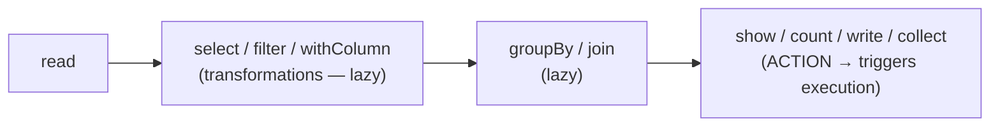
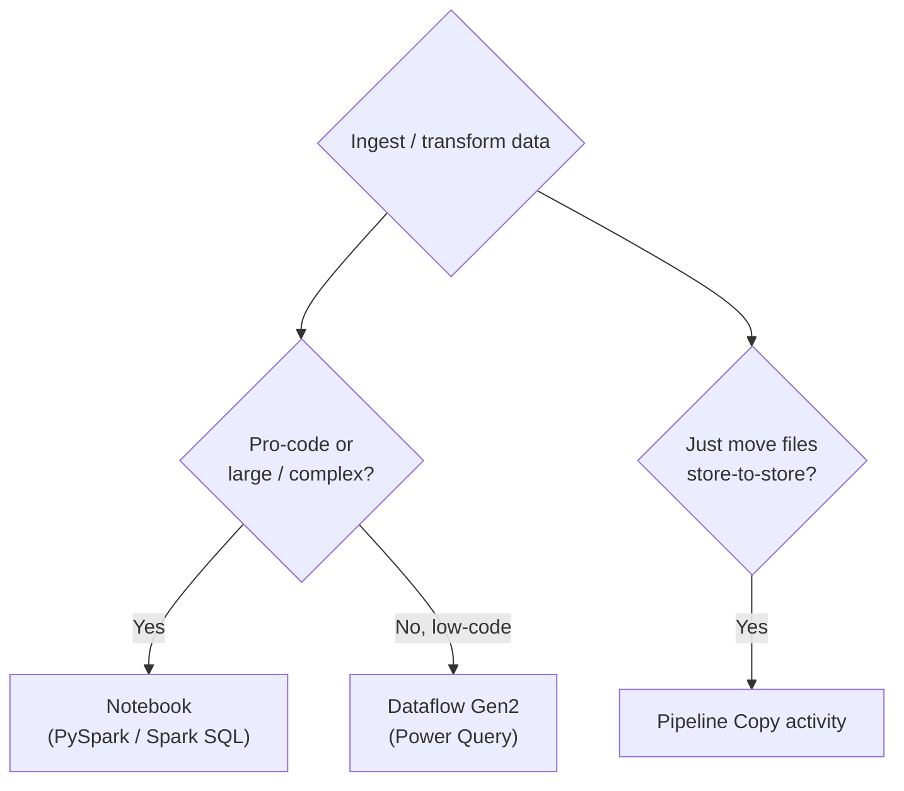

# 🐍 Appendix E — PySpark Reference & Exam Caveats
{: .no_toc }

> - Based on: *PySpark DataFrame API in Fabric Notebooks* (Microsoft Learn)
> - 📁 [← Back to Home](/dp-600-study-notes/)

Syntax reference for **PySpark** (the Python DataFrame API) as tested on DP-600. PySpark runs in **Notebooks and Spark job definitions** to ingest, transform, and write **Lakehouse** Delta tables. The exam tests reading a snippet, save modes, lazy evaluation, and when a Notebook beats a Dataflow — not writing large pipelines by hand.
{: .fs-5 .fw-300 }

<details open markdown="block">
  <summary>Table of contents</summary>
  {: .text-delta }
- TOC
{:toc}
</details>

---

## 🧭 1 — PySpark, Spark SQL & Where They Run

PySpark and [Spark SQL](/dp-600-study-notes/08-appendix-spark-sql-reference/) are two front-ends over the **same Spark engine**. In a Notebook you can switch freely:

```python
df = spark.sql("SELECT * FROM sales WHERE Amount > 100")   # SQL → DataFrame
df.createOrReplaceTempView("big_sales")                    # DataFrame → SQL
```

| Front-end | Style | Best for |
|-----------|-------|----------|
| **PySpark** | Python, DataFrame methods | Complex logic, ML prep, reusable functions |
| **Spark SQL** | Declarative SQL | Set-based transforms, analysts |

> **Exam Tip:** They are interchangeable and mixable in the same Notebook — `spark.sql()` returns a DataFrame; `createOrReplaceTempView()` exposes a DataFrame to SQL. A question implying you must pick one *exclusively* is usually a distractor.
{: .note }

---

## 📥 2 — Reading Data

```python
# Read a Lakehouse Delta table (by name)
df = spark.read.table("sales")

# Read files
df = spark.read.format("delta").load("Tables/sales")
csv = spark.read.option("header", True).option("inferSchema", True).csv("Files/raw/sales.csv")
pq  = spark.read.parquet("Files/raw/sales.parquet")
```

| Source | Call |
|--------|------|
| Managed table | `spark.read.table("name")` |
| Delta path | `spark.read.format("delta").load(path)` |
| CSV | `spark.read.option("header", True).csv(path)` |
| Parquet / JSON | `spark.read.parquet(path)` / `.json(path)` |

> **Exam Tip:** `inferSchema=True` costs an extra pass over the data. For large or stable files, supplying an explicit `StructType` schema is faster and safer than inference — a performance-oriented answer.
{: .note }

---

## 🔄 3 — Transformations (Lazy) vs Actions (Eager)



> **Key Point:** PySpark is **lazy**. Transformations (`select`, `filter`, `withColumn`, `join`, `groupBy`) only build a plan; **nothing runs until an action** (`show()`, `count()`, `collect()`, `write`, `display()`) forces evaluation. This is why "the cell was instant but the write took minutes" — the write triggered the whole chain.
{: .note }

| Transformations (lazy) | Actions (eager) |
|------------------------|-----------------|
| `select`, `filter`/`where`, `withColumn` | `show`, `display`, `count` |
| `groupBy().agg()`, `join`, `orderBy` | `collect`, `take`, `first` |
| `drop`, `distinct`, `withColumnRenamed` | `write`, `save`, `saveAsTable` |

> **Exam Caveat:** `collect()` pulls **all rows to the driver** and can crash it on big data — prefer `show()`/`display()` for inspection and `write` for output. "Why did the driver run out of memory?" is often a `collect()` on a large DataFrame.
{: .warning }

---

## 🧰 4 — Common DataFrame Operations

```python
from pyspark.sql import functions as F

result = (
    df.filter(F.col("Amount") > 100)
      .withColumn("Tax", F.col("Amount") * 0.2)
      .groupBy("Category")
      .agg(F.sum("Amount").alias("Total"),
           F.countDistinct("OrderId").alias("Orders"))
      .orderBy(F.desc("Total"))
)
result.show()
```

| Task | PySpark |
|------|---------|
| Filter rows | `df.filter(F.col("x") > 1)` / `df.where(...)` |
| Add / change column | `df.withColumn("c", F.col("a") + F.col("b"))` |
| Select / rename | `df.select("a", F.col("b").alias("bb"))` |
| Group + aggregate | `df.groupBy("g").agg(F.sum("v"))` |
| Join | `df1.join(df2, "key", "left")` |
| Deduplicate | `df.dropDuplicates(["k"])` |
| Sort | `df.orderBy(F.desc("v"))` |

> **Exam Caveat:** Use `F.col("x")` or `df["x"]` for column references inside expressions — a bare string works for simple `select`/`groupBy` but **not** for arithmetic or conditions. And join type defaults to `inner`; specify `"left"`, `"anti"`, etc., explicitly when needed.
{: .warning }

---

## 📤 5 — Writing Data & Save Modes

```python
# Save as a managed Lakehouse Delta table
df.write.format("delta").mode("overwrite").saveAsTable("sales_curated")

# Save to a path (external)
df.write.format("delta").mode("append").save("Files/curated/sales")

# Partitioned write
df.write.partitionBy("Year").mode("overwrite").saveAsTable("sales_by_year")
```

| `mode(...)` | Behaviour if table/data exists |
|-------------|--------------------------------|
| `"overwrite"` | Replace existing data |
| `"append"` | Add new rows |
| `"error"` / `"errorifexists"` (default) | Fail |
| `"ignore"` | Silently skip the write |

> **Exam Caveat:** `saveAsTable()` registers a **managed** table in the Lakehouse metastore (visible to the SQL endpoint & Power BI); `save(path)` writes files **without** a catalog entry. If a scenario needs the data queryable from the SQL analytics endpoint or Direct Lake, use `saveAsTable()` (or otherwise register the table) — a raw `save()` alone won't surface it as a table.
{: .warning }

> **Exam Tip:** The default write mode is **error-if-exists**. Re-running a Notebook that uses the default mode will *fail* on the second run — production loads use `overwrite` (full) or `append`/`MERGE` (incremental).
{: .note }

---

## 🔺 6 — Delta Upserts from PySpark (`DeltaTable.merge`)

For row-level upserts, PySpark uses the Delta API rather than a plain DataFrame write:

```python
from delta.tables import DeltaTable

target = DeltaTable.forName(spark, "sales")
(target.alias("t")
    .merge(updates_df.alias("u"), "t.Id = u.Id")
    .whenMatchedUpdateAll()
    .whenNotMatchedInsertAll()
    .execute())
```

> **Exam Tip:** `DeltaTable.merge(...)` is the PySpark equivalent of Spark SQL's `MERGE INTO` — the go-to for incremental/CDC upserts into a Lakehouse. A plain `mode("append")` write would duplicate rows instead of updating them.
{: .note }

---

## 🖥️ 7 — Displaying & Converting Results

| Call | Effect |
|------|--------|
| `display(df)` | Rich, interactive Fabric grid + charts (**preferred**) |
| `df.show(n)` | Plain-text preview of n rows |
| `df.printSchema()` | Show column names & types |
| `df.toPandas()` | Convert to a pandas DataFrame (**driver memory!**) |

> **Exam Caveat:** `toPandas()` and `collect()` both **materialize all data on the driver node** — fine for small results, dangerous at scale. For big data, keep everything distributed and write back to Delta rather than converting to pandas.
{: .warning }

---

## ⚙️ 8 — When to Use a Notebook (PySpark) at All



> **Exam Tip:** Choose **Notebook/PySpark** for complex transformations, ML feature engineering, large-scale ELT, or reusable parameterized logic. Choose **Dataflow Gen2** for low-code Power Query transforms, and **Copy activity** for straight bulk movement. Matching tool to scenario is heavily tested.
{: .note }

---

## ⚠️ 9 — PySpark Exam Traps (Rapid Fire)

1. **Transformations are lazy; actions trigger execution** — `write`/`show`/`count`/`collect` run the plan.
2. **`collect()` / `toPandas()` pull all data to the driver** — OOM risk at scale.
3. **`saveAsTable()` = managed table (catalog-visible); `save(path)` = files only.**
4. **Default write mode is error-if-exists** — re-runs fail without `overwrite`/`append`.
5. **Use `F.col("x")`** for column expressions, not bare strings, in arithmetic/conditions.
6. **Row-level upserts use `DeltaTable.merge`**, not an `append` write.
7. **PySpark and Spark SQL are interchangeable** in one Notebook via `spark.sql()` / temp views.
8. **`partitionBy` affects file layout** — helps large-table filter/prune performance.
9. **Prefer `display()`** for inspection in Fabric; reserve `show()` for plain text.
10. **Notebook for pro-code/large transforms; Dataflow Gen2 for low-code; Copy for bulk movement.**

> **Exam Tip:** For snippet-reading questions, first find the **action** — that's where work happens. Then check the **write**: `saveAsTable` vs `save`, and the `mode`, decide whether the data becomes a queryable table and whether a re-run succeeds.
{: .note }

---

[← Appendix D — Spark SQL Reference](/dp-600-study-notes/08-appendix-spark-sql-reference/) | [Back to Home →](/dp-600-study-notes/)
